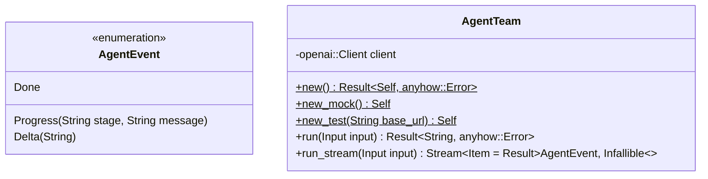
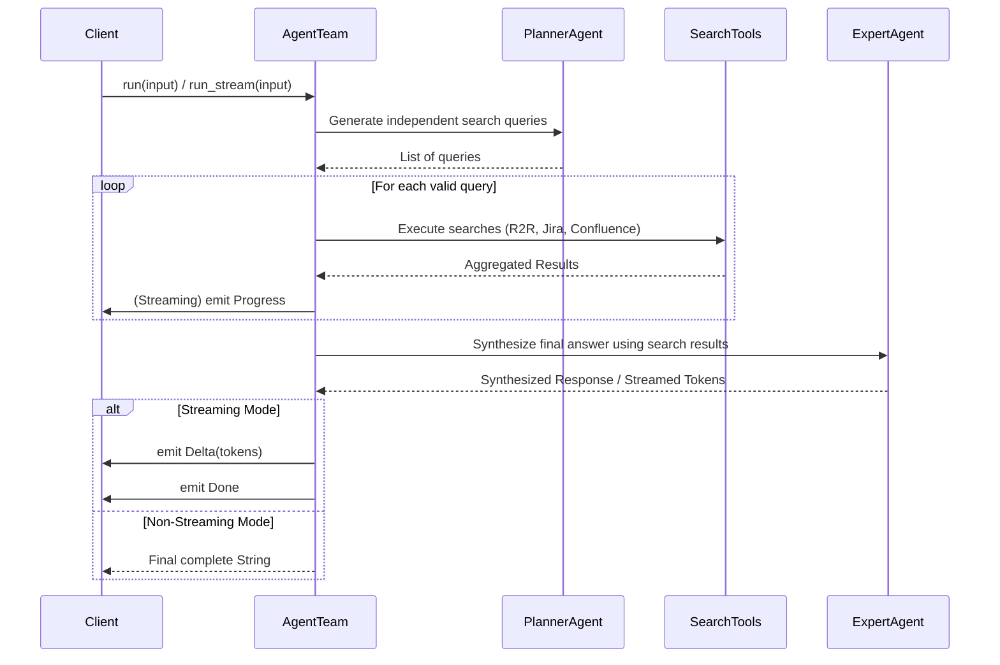

# agent-team.rs

This module defines the `AgentTeam` which orchestrates multi-agent tasks, handling streaming (`run_stream`) and non-streaming (`run`) operations for the LLM pipeline, integrating search tools.

### Execution Flow

