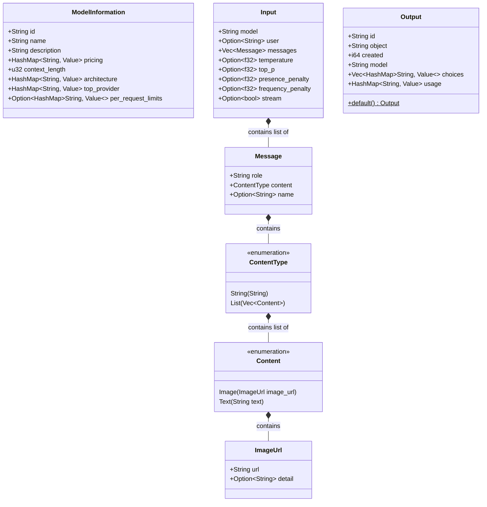

# dtos.rs

This module defines the Data Transfer Objects (DTOs) used for API communication, representing inputs, outputs, messages, and model information.

```mermaid
classDiagram
    class ImageUrl {
        +String url
        +Option~String~ detail
    }

    class Content {
        <<enumeration>>
        Image(ImageUrl image_url)
        Text(String text)
    }
    Content *-- ImageUrl : contains

    class ModelInformation {
        +String id
        +String name
        +String description
        +HashMap~String, Value~ pricing
        +u32 context_length
        +HashMap~String, Value~ architecture
        +HashMap~String, Value~ top_provider
        +Option~HashMap~String, Value~~ per_request_limits
    }

    class Message {
        +String role
        +ContentType content
        +Option~String~ name
    }
    Message *-- ContentType : contains

    class ContentType {
        <<enumeration>>
        String(String)
        List(Vec~Content~)
    }
    ContentType *-- Content : contains list of

    class Input {
        +String model
        +Option~String~ user
        +Vec~Message~ messages
        +Option~f32~ temperature
        +Option~f32~ top_p
        +Option~f32~ presence_penalty
        +Option~f32~ frequency_penalty
        +Option~bool~ stream
    }
    Input *-- Message : contains list of

    class Output {
        +String id
        +String object
        +i64 created
        +String model
        +Vec~HashMap~String, Value~~ choices
        +HashMap~String, Value~ usage
        +default() Output$
    }
```
