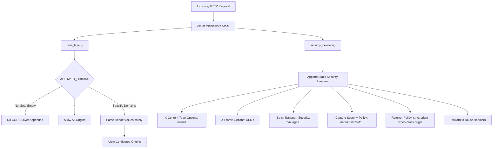

# middleware.rs

This module defines Tower middleware layers that are applied globally to Axum routes to enforce security boundaries and configure Cross-Origin Resource Sharing (CORS).

```mermaid
flowchart TD
    Req[Incoming HTTP Request]

    Req --> MiddlewareStack[Axum Middleware Stack]

    MiddlewareStack --> CorsLayer["cors_layer()"]
    CorsLayer --> CheckEnv{"ALLOWED_ORIGINS"}
    CheckEnv -- Not Set / Empty --> DenyCors[No CORS Layer Appended]
    CheckEnv -- "*" --> AllowAll[Allow All Origins]
    CheckEnv -- "Specific Domains" --> ParseOrigins[Parse HeaderValues safely]
    ParseOrigins --> AllowSpecific[Allow Configured Origins]

    MiddlewareStack --> SecurityHeaders["security_headers()"]
    SecurityHeaders --> AddHeaders[Append Static Security Headers]

    AddHeaders --> ContentTypeOptions["X-Content-Type-Options: nosniff"]
    AddHeaders --> FrameOptions["X-Frame-Options: DENY"]
    AddHeaders --> HSTS["Strict-Transport-Security: max-age=..."]
    AddHeaders --> CSP["Content-Security-Policy: default-src 'self'..."]
    AddHeaders --> ReferrerPolicy["Referrer-Policy: strict-origin-when-cross-origin"]

    AddHeaders --> Handlers[Forward to Route Handlers]
```
