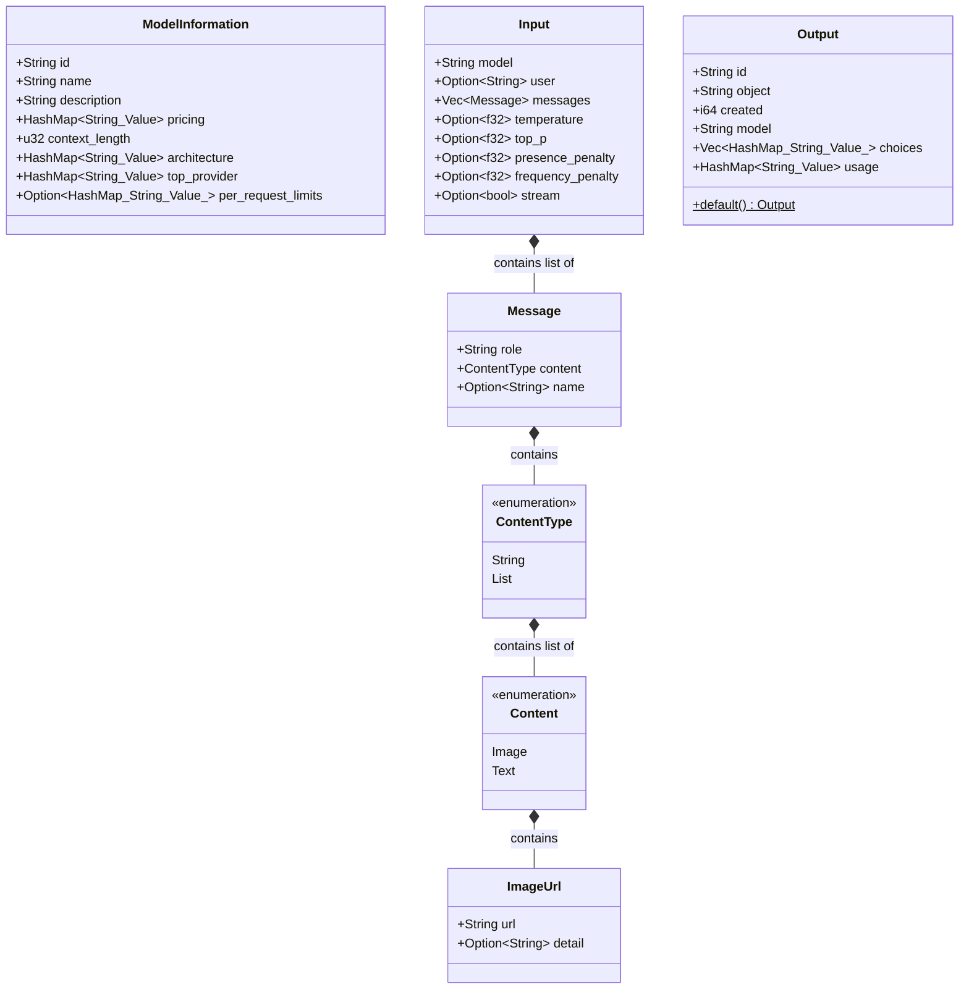
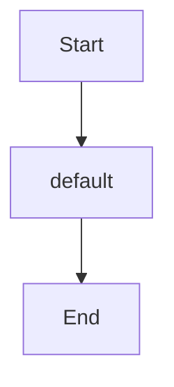

Source File: `src/application/dtos.rs`

## Component Overview

This module defines the `Dtos` component.

## Architecture

### Class Diagram

### Execution Flow

## Dependencies
- `serde::{Deserialize, Serialize}`
- `serde_json::Value`
- `std::collections::HashMap`
