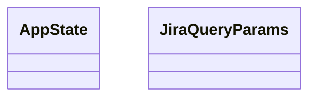
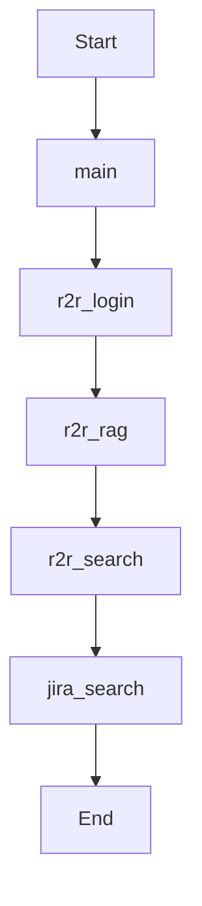

Source File: `src/bin/mock_services.rs`

## Component Overview

This module defines the `MockServices` component.

## Architecture

### Class Diagram

### Execution Flow

## Dependencies
- `axum::{ extract::Query, routing::{get, post}, Json, Router, }`
- `serde::Deserialize`
- `serde_json::{json, Value}`
- `std::net::SocketAddr`
- `std::sync::Arc`
- `tracing_subscriber::{layer::SubscriberExt, util::SubscriberInitExt}`
