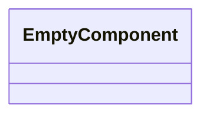
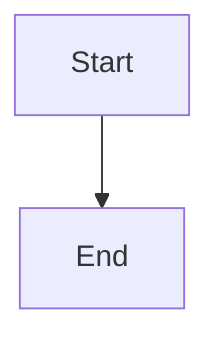

Source File: `src/domain/agent/mod.rs`

## Component Overview

This module defines the `AgentModule` component.

## Architecture

### Class Diagram

```mermaid
classDiagram
    class EmptyComponent
```

### Execution Flow

```mermaid
flowchart TD
    Start --> End
```

## Dependencies
None
