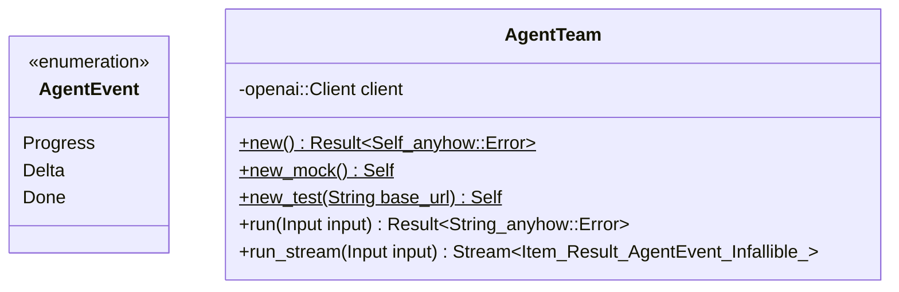
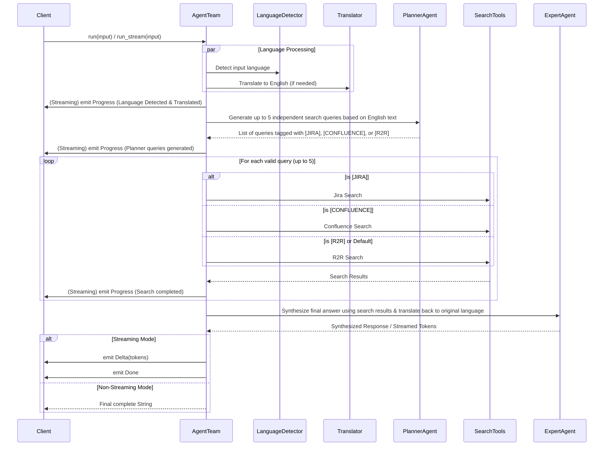

Source File: `src/domain/agent/team.rs`

## Component Overview

This module defines the `Team` component.

## Architecture

### Class Diagram

### Execution Flow

## Dependencies
- `crate::application::dtos::Input`
- `crate::infrastructure::tools::confluence::ConfluenceTool`
- `crate::infrastructure::tools::jira::JiraTool`
- `crate::infrastructure::tools::r2r::R2RTool`
- `async_stream::stream`
- `futures::{future::join_all, Stream, StreamExt}`
- `rig::agent::MultiTurnStreamItem`
- `rig::client::CompletionClient`
- `rig::completion::Prompt`
- `rig::providers::openai`
- `rig::streaming::{StreamedAssistantContent, StreamingPrompt}`
- `serde_json`
- `std::env`
- `std::pin::Pin`
