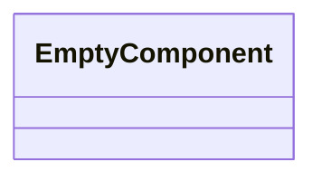
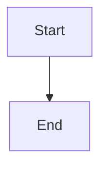

Source File: `src/domain/mod.rs`

## Component Overview

This module defines the `DomainModule` component.

## Architecture

### Class Diagram

### Execution Flow

## Dependencies
No direct internal dependencies.
