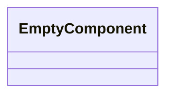
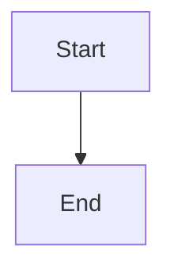

Source File: `src/infrastructure/mod.rs`

## Component Overview

This module defines the `InfrastructureModule` component.

## Architecture

### Class Diagram

### Execution Flow

## Dependencies
None
