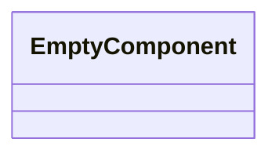
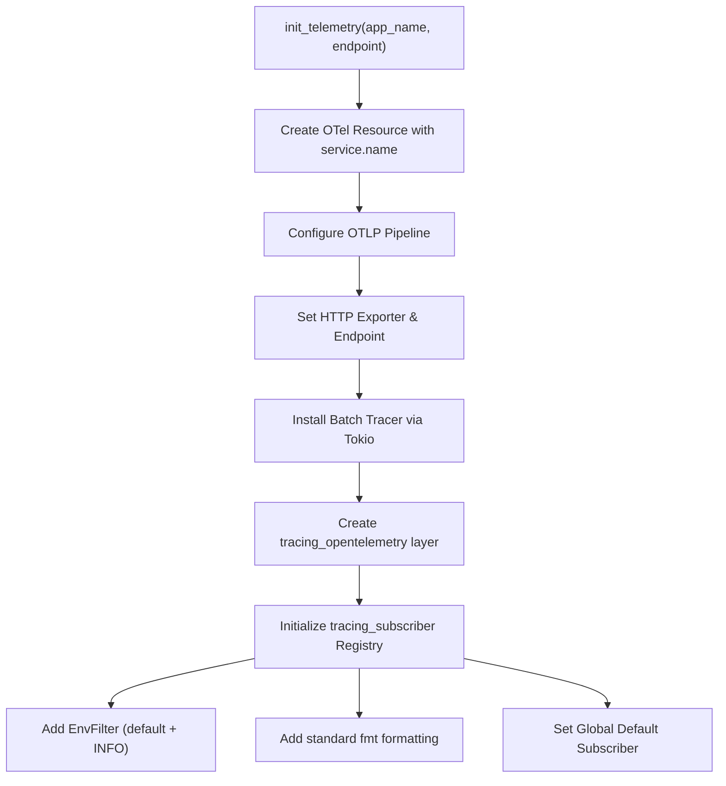

Source File: `src/infrastructure/telemetry.rs`

## Component Overview

This module defines the `Telemetry` component.

## Architecture

### Class Diagram

### Execution Flow

## Dependencies
- `opentelemetry::KeyValue`
- `opentelemetry_otlp::WithExportConfig`
- `opentelemetry_sdk::{runtime, trace::Config, Resource}`
- `tracing_subscriber::{layer::SubscriberExt, util::SubscriberInitExt, EnvFilter}`
