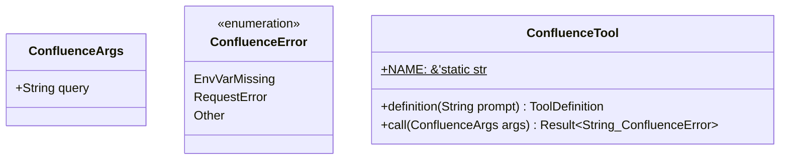
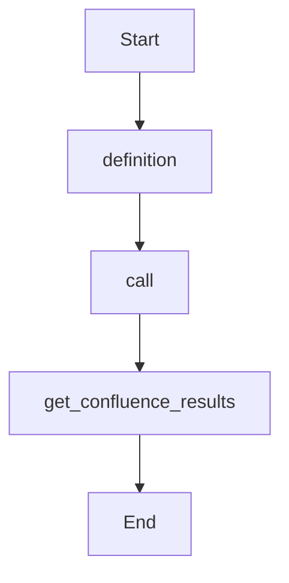

Source File: `src/infrastructure/tools/confluence.rs`

## Component Overview

This module defines the `Confluence` component.

## Architecture

### Class Diagram

### Execution Flow

## Dependencies
- `rig::completion::ToolDefinition`
- `rig::tool::Tool`
- `serde::Deserialize`
- `serde_json::json`
- `std::env`
- `thiserror::Error`
