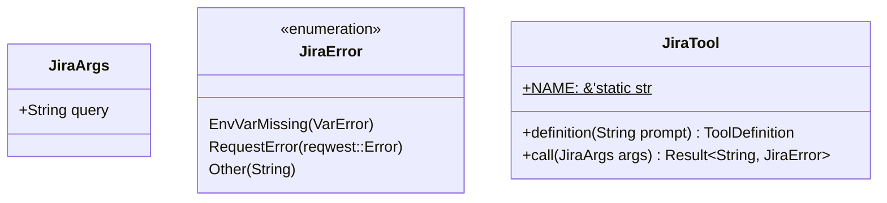

Source File: `src/infrastructure/tools/jira.rs`

## Component Overview

This module defines the `Jira` component.

## Architecture

### Class Diagram


### Execution Flow
```mermaid
flowchart TD
    Start --> definition
    definition --> call
    call --> get_jira_results
    get_jira_results --> End
```

## Dependencies
- `rig::completion::ToolDefinition`
- `rig::tool::Tool`
- `serde::Deserialize`
- `serde_json::json`
- `std::env`
- `thiserror::Error`
