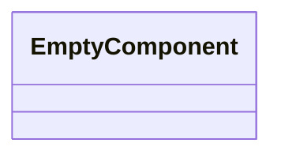
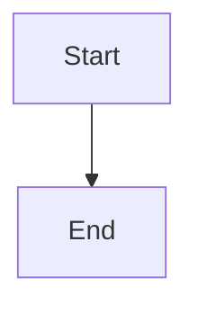

Source File: `src/infrastructure/tools/mod.rs`

## Component Overview

This module defines the `ToolsModule` component.

## Architecture

### Class Diagram

### Execution Flow

## Dependencies
No direct internal dependencies.
