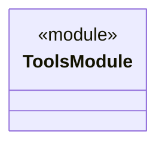
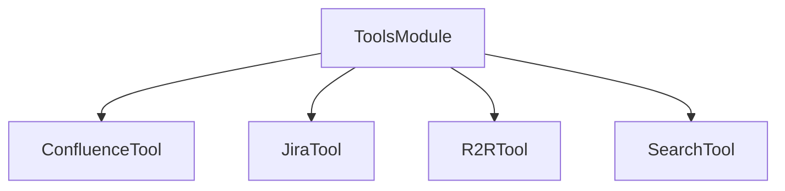

Source File: `src/infrastructure/tools/mod.rs`

## Component Overview

This module exports the available search tools for the application.

## Architecture

### Class Diagram

### Dependency Edges

## Dependencies
- `confluence`
- `jira`
- `r2r`
- `search`