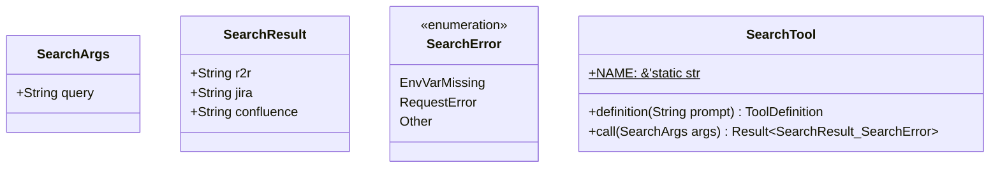

Source File: `src/infrastructure/tools/search.rs`

## Component Overview

This module defines the `Search` component.

## Architecture

### Class Diagram


### Execution Flow
```mermaid
flowchart TD
    Start --> definition
    definition --> call
    call --> End
```

## Dependencies
- `crate::infrastructure::tools::confluence::get_confluence_results`
- `crate::infrastructure::tools::jira::get_jira_results`
- `crate::infrastructure::tools::r2r::get_r2r_results`
- `rig::completion::ToolDefinition`
- `rig::tool::Tool`
- `serde::{Deserialize, Serialize}`
- `serde_json::json`
- `std::env`
- `thiserror::Error`
