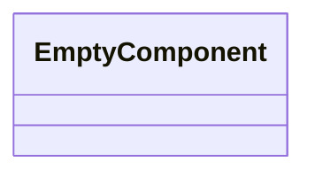
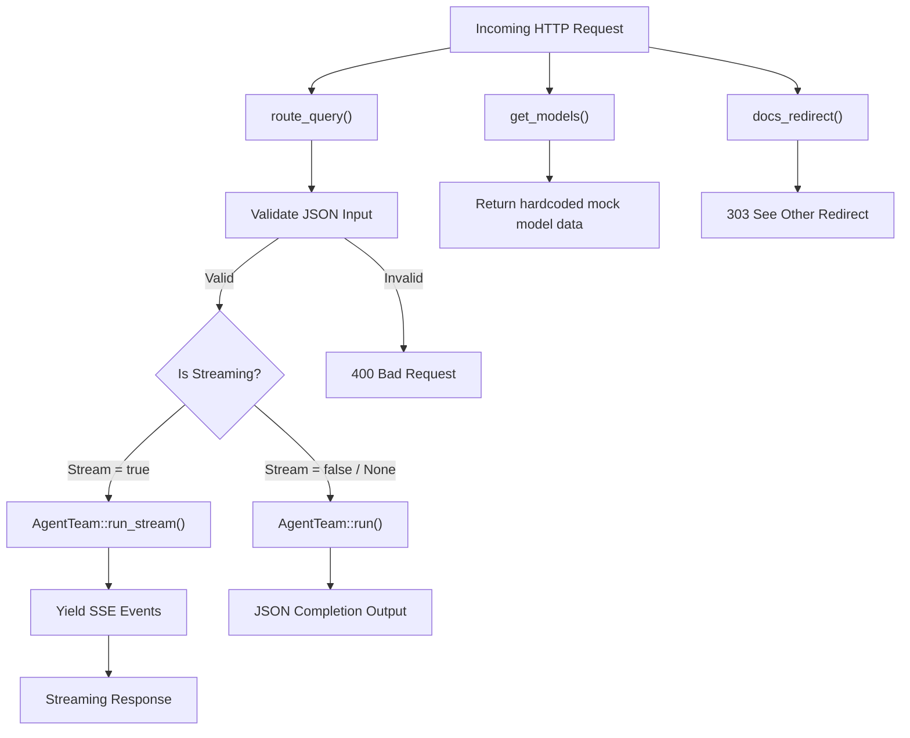

Source File: `src/interface/http/handlers.rs`

## Component Overview

This module defines the `Handlers` component.

## Architecture

### Class Diagram

### Execution Flow

## Dependencies
- `axum::{ extract::State, http::{HeaderMap, StatusCode}, response::{sse::Event, IntoResponse, Sse}, Json, }`
- `futures::StreamExt`
- `serde_json::json`
- `std::convert::Infallible`
- `std::sync::Arc`
- `crate::application::dtos::Input`
- `crate::domain::agent::team::AgentEvent`
- `crate::interface::http::routes::AppState`
- `crate::interface::http::validation::ValidatedJson`
