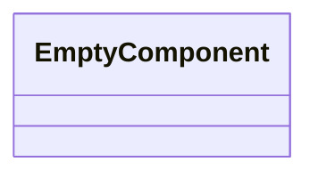
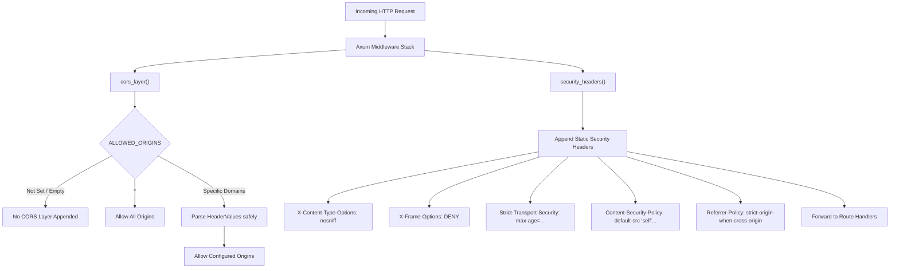

Source File: `src/interface/http/middleware.rs`

## Component Overview

This module defines the `Middleware` component.

## Architecture

### Class Diagram

### Execution Flow

## Dependencies
- `axum::http::{HeaderName, HeaderValue}`
- `std::env`
- `tower_http::cors::{AllowOrigin, CorsLayer}`
- `tower_http::set_header::SetResponseHeaderLayer`
