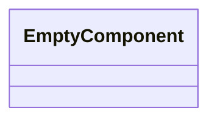
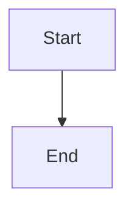

Source File: `src/interface/http/mod.rs`

## Component Overview

This module defines the `HttpModule` component.

## Architecture

### Class Diagram

### Execution Flow

## Dependencies
No direct internal dependencies.
