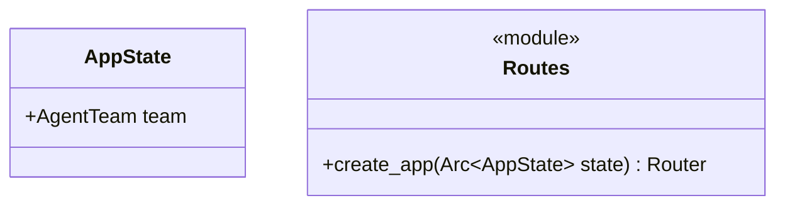

Source File: `src/interface/http/routes.rs`

## Component Overview

This module defines the shared application state and the router configuration for the Axum web server, including routes, middleware, and state injection.

## Architecture

### Class Diagram


### Execution Flow
```mermaid
flowchart TD
    Init[create_app(state)] --> BaseRouter[Create Base Router]
    BaseRouter --> DocsRoute[Add /agent -> docs_redirect]
    BaseRouter --> ApiV1Beta[Nest /agent/api/v1beta]
    ApiV1Beta --> ModelsRoute[Add /models -> get_models]
    ApiV1Beta --> ChatRoute[Add /chat/completions -> route_query]
    BaseRouter --> State[Inject AppState]
    State --> SecLayers[Apply Security Headers Layer]
    SecLayers --> CORS[Apply CORS Layer if configured]
    CORS --> TraceLayer[Apply Http TraceLayer]
    TraceLayer --> FinalRouter[Return Axum Router]
```

## Dependencies
- `crate::domain::agent::team::AgentTeam`
- `crate::interface::http::handlers::{docs_redirect, get_models, route_query}`
- `crate::interface::http::middleware::{cors_layer, security_headers}`
- `axum::{routing::{get, post}, Router}`
- `std::sync::Arc`
- `tower_http::trace::TraceLayer`