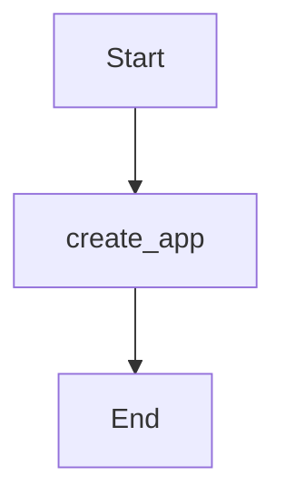

Source File: `src/interface/http/routes.rs`

## Component Overview

This module defines the `Routes` component.

## Architecture

### Class Diagram

### Execution Flow

## Dependencies
- `crate::domain::agent::team::AgentTeam`
- `crate::interface::http::handlers::{docs_redirect, get_models, route_query}`
- `crate::interface::http::middleware::{cors_layer, security_headers}`
- `axum::{ routing::{get, post}, Router, }`
- `std::sync::Arc`
- `tower_http::trace::TraceLayer`
