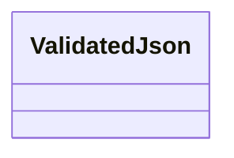
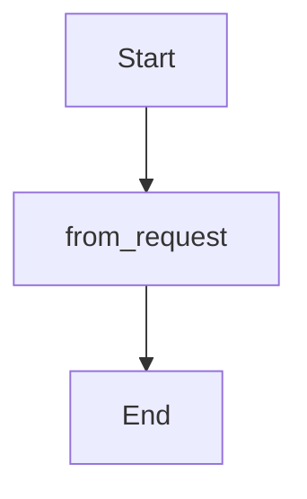

Source File: `src/interface/http/validation.rs`

## Component Overview

This module defines the `Validation` component.

## Architecture

### Class Diagram

### Execution Flow

## Dependencies
- `axum::{ async_trait, extract::{FromRequest, Request}, http::StatusCode, response::{IntoResponse, Response}, Json, }`
- `serde::de::DeserializeOwned`
