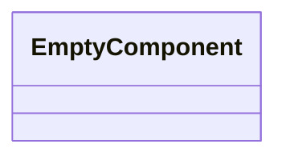
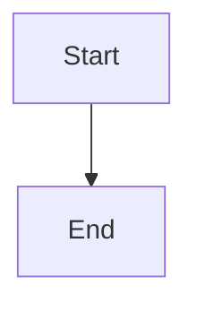

Source File: `src/lib.rs`

## Component Overview

This module defines the `Lib` component.

## Architecture

### Class Diagram

### Execution Flow

## Dependencies
No direct internal dependencies.
