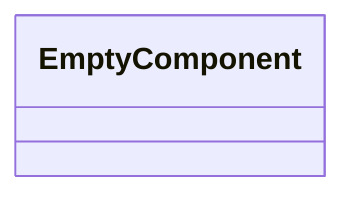
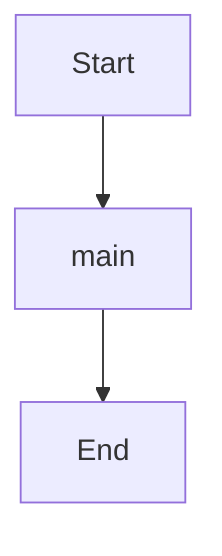

Source File: `src/main.rs`

## Component Overview

This module defines the `Main` component.

## Architecture

### Class Diagram

### Execution Flow

## Dependencies
- `dotenvy::dotenv`
- `rust_agent_team::domain::agent::team::AgentTeam`
- `rust_agent_team::infrastructure::telemetry`
- `rust_agent_team::{create_app, AppState}`
- `std::env`
- `std::sync::Arc`
