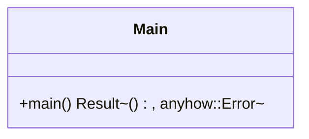

Source File: `src/main.rs`

## Component Overview

This module is the entry point of the application. It initializes the environment, telemetry, shared state, and starts the Axum web server.

## Architecture

### Class Diagram


### Execution Flow
```mermaid
flowchart TD
    Start --> LoadEnv[dotenv().ok()]
    LoadEnv --> GetVars[Read ENV vars (APP_NAME, DEFAULT_OTEL_ENDPOINT, DEFAULT_HOST, DEFAULT_PORT)]
    GetVars --> InitTelemetry[telemetry::init_telemetry]
    InitTelemetry --> InitTeam[AgentTeam::new().await]
    InitTeam --> BuildState[Arc::new(AppState { team })]
    BuildState --> Routing[create_app(state)]
    Routing --> BindAddr[TcpListener::bind]
    BindAddr --> Serve[axum::serve(listener, app)]
    Serve --> End
```

## Dependencies
- `dotenvy::dotenv`
- `rust_agent_team::domain::agent::team::AgentTeam`
- `rust_agent_team::infrastructure::telemetry`
- `rust_agent_team::{create_app, AppState}`
- `std::env`
- `std::sync::Arc`