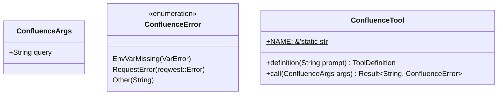

# confluence.rs

This module provides the `ConfluenceTool`, used by the agent to perform textual searches against a linked Confluence instance via the Atlassian API.

```mermaid
classDiagram
    class ConfluenceArgs {
        +String query
    }

    class ConfluenceError {
        <<enumeration>>
        EnvVarMissing(VarError)
        RequestError(reqwest::Error)
        Other(String)
    }

    class ConfluenceTool {
        +NAME: &'static str$
        +definition(String prompt) ToolDefinition
        +call(ConfluenceArgs args) Result~String, ConfluenceError~
    }
```
