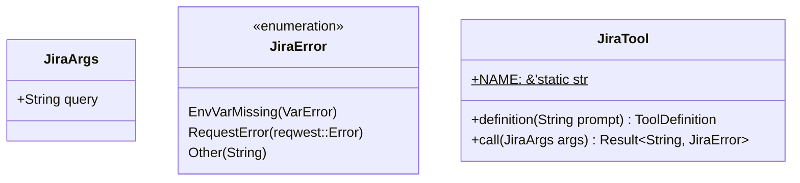

# jira.rs

This module provides the `JiraTool`, which allows the agent to search for Jira issues and tasks using standard or inferred JQL queries.

```mermaid
classDiagram
    class JiraArgs {
        +String query
    }

    class JiraError {
        <<enumeration>>
        EnvVarMissing(VarError)
        RequestError(reqwest::Error)
        Other(String)
    }

    class JiraTool {
        +NAME: &'static str$
        +definition(String prompt) ToolDefinition
        +call(JiraArgs args) Result~String, JiraError~
    }
```
