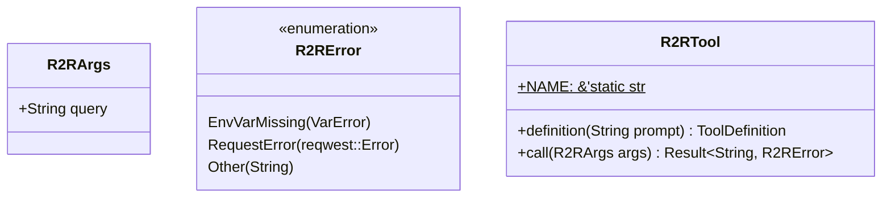

# r2r.rs

This module provides the `R2RTool`, responsible for authenticating and querying the external R2R vector database for contextual information retrieval.

```mermaid
classDiagram
    class R2RArgs {
        +String query
    }

    class R2RError {
        <<enumeration>>
        EnvVarMissing(VarError)
        RequestError(reqwest::Error)
        Other(String)
    }

    class R2RTool {
        +NAME: &'static str$
        +definition(String prompt) ToolDefinition
        +call(R2RArgs args) Result~String, R2RError~
    }
```
