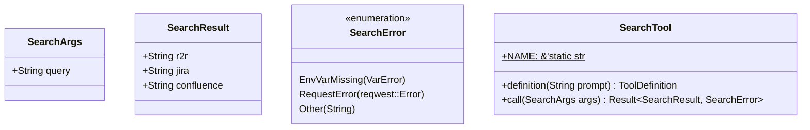

# search.rs

This module provides the `SearchTool`, a rig-compatible tool that aggregates sub-searches from R2R, Jira, and Confluence into a single structured result.

```mermaid
classDiagram
    class SearchArgs {
        +String query
    }

    class SearchResult {
        +String r2r
        +String jira
        +String confluence
    }

    class SearchError {
        <<enumeration>>
        EnvVarMissing(VarError)
        RequestError(reqwest::Error)
        Other(String)
    }

    class SearchTool {
        +NAME: &'static str$
        +definition(String prompt) ToolDefinition
        +call(SearchArgs args) Result~SearchResult, SearchError~
    }
```
