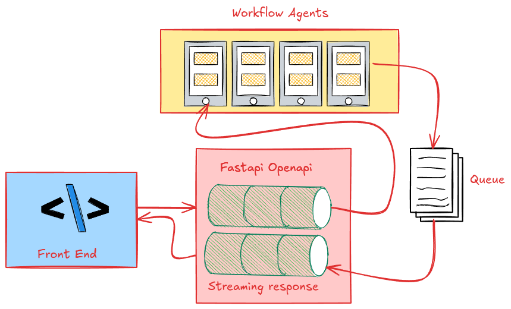
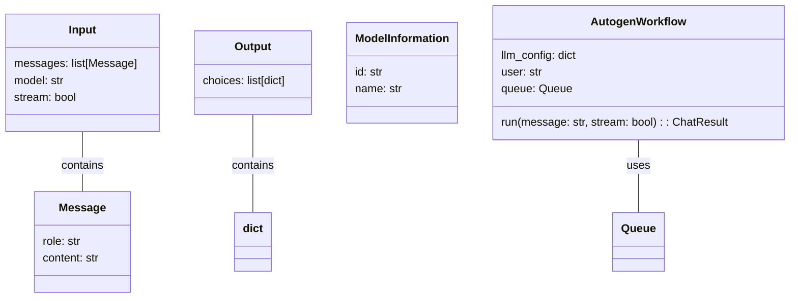
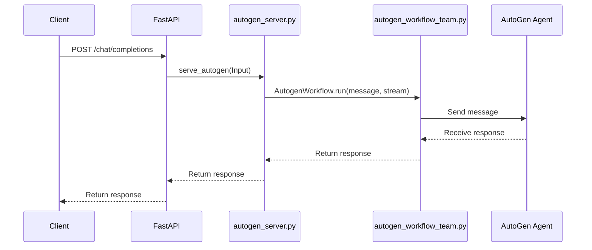

# Fastapi-Autogen-team Python Package

[](https://github.com/lgcorzo/fastapi-autogen-team/actions/workflows/check.yml)
[](https://github.com/lgcorzo/fastapi-autogen-team/actions/workflows/publish.yml)
[](https://lgcorzo.github.io/fastapi-autogen-team/)
[](https://github.com/lgcorzo/fastapi-autogen-team/blob/main/LICENCE.txt)
[](https://github.com/lgcorzo/fastapi-autogen-team/releases)
[](https://deepwiki.com/lgcorzo/fastapi-autogen-team)

**This repository contains a Python codebase with best practices designed to support your MLOps initiatives if the project fasyapi-autogen-teams**

The package leverages several tools and tips to make your MLOps experience as flexible, robust, and productive as possible. You can use this package as part of your MLOps toolkit or platform (e.g., Model Registry, Experiment Tracking, Realtime Inference).


# Table of Contents

- [Fastapi-Autogen-team Python Package](#fastapi-autogen-team-python-package)
- [Table of Contents](#table-of-contents)
- [Install](#install)
  - [Prerequisites](#prerequisites)
  - [Installation](#installation)
  - [Next Steps](#next-steps)
  - [Automation](#automation)
  - [Workflows](#workflows)
    - [1. **Project Purpose**](#1-project-purpose)
    - [2. **Project Setup**](#2-project-setup)
    - [3. **Project Structure**](#3-project-structure)
    - [4. **Implementing the Streaming Interface**](#4-implementing-the-streaming-interface)
    - [5. **Request Handling**](#5-request-handling)
    - [6. **Performance Optimization**](#6-performance-optimization)
    - [7. **Testing**](#7-testing)
    - [8. **Conclusion**](#8-conclusion)
  - [References:](#references)

# Install

This section details the requirements, actions, and next steps to kickstart your MLOps project.

## Prerequisites

*   Python>=3.11: to benefit from the latest features and performance improvements
*   Poetry>=1.8.2: to initialize the project virtual environment and its dependencies

## Installation

1.  Clone this GitHub repository on your computer

    ```bash
    # with ssh (recommended)
    $ git clone git@github.com:lgcorzo/fastapi-autogen-team.git
    or https
    $ git clone https://github.com/lgcorzo/fastapi-autogen-team
    ```
2.  Run the project installation with poetry ( install poetry in the base  env )

    ```bash
    $ cd fastapi-autogen-team/
    $ poetry env use $(which python)
    $ poetry install
    $ poetry env activate
    ```

    ```bash
    $ poetry run invoke containers.build
    ```

## Next Steps

Going from there, there are dozens of ways to integrate this package to your MLOps platform. For instance, you can use Databricks or AWS as your compute platform and model registry. It's up to you to adapt the package code to the solution you target.

Debugging in VS Code is possible with the following configuration:

```json
{
    "version": "0.2.0",
    "configurations": [
        {
            "name": "Poetry evaluations Debug",
            "type": "python",
            "request": "launch",
            "program": "${workspaceFolder}/src/fastapi_autogen_team/main.py", // Adjust the entry point path
            "console": "integratedTerminal",
            "cwd": "${workspaceFolder}", // Set the working directory to the project root
            "env": {
                "PYTHONPATH": "${workspaceFolder}/src"
            } // Ensure module discovery
        }
    ]
}
```

In production, you can build, ship, and run the project as a Python package:

```bash
poetry build
poetry publish # optional
python -m pip install [package]
[package] confs/inference.yaml

## added mocogpt for integration test if you need to simualte a chatgpt call
poetry add --group checks "mocogpt[cli]@git+https://github.com/lgcorzo/mocogpt.git"
```

## Automation

This project includes several automation tasks to easily repeat common actions. You can invoke the actions from the command line or VS Code extension.

```bash
# execute the project DAG
$ inv projects
# create a code archive
$ inv packages
# list other actions
$ inv --list
```

**Available tasks**:

*   **checks.all (checks)** - Run all check tasks.
*   **checks.code** - Check the codes with ruff.
*   **checks.coverage** - Check the coverage with coverage.
*   **checks.format** - Check the formats with ruff.
*   **checks.poetry** - Check poetry config files.
*   **checks.security** - Check the security with bandit.
*   **checks.test** - Check the tests with pytest.
*   **checks.type** - Check the types with mypy.
*   **cleans.all (cleans)** - Run all tools and folders tasks.
*   **cleans.cache** - Clean the cache folder.
*   **cleans.coverage** - Clean the coverage tool.
*   **cleans.dist** - Clean the dist folder.
*   **cleans.docs** - Clean the docs folder.
*   **cleans.environment** - Clean the project environment file.
*   **cleans.folders** - Run all folders tasks.
*   **cleans.mypy** - Clean the mypy tool.
*   **cleans.outputs** - Clean the outputs folder.
*   **cleans.poetry** - Clean poetry lock file.
*   **cleans.pytest** - Clean the pytest tool.
*   **cleans.projects** - Run all projects tasks.
*   **cleans.python** - Clean python caches and bytecodes.
*   **cleans.requirements** - Clean the project requirements file.
*   **cleans.reset** - Run all tools, folders, and sources tasks.
*   **cleans.ruff** - Clean the ruff tool.
*   **cleans.sources** - Run all sources tasks.
*   **cleans.tools** - Run all tools tasks.
*   **cleans.venv** - Clean the venv folder.
*   **commits.all (commits)** - Run all commit tasks.
*   **commits.bump** - Bump the version of the package.
*   **commits.commit** - Commit all changes with a message.
*   **commits.info** - Print a guide for messages.
*   **containers.all (containers)** - Run all container tasks.
*   **containers.build** - Build the container image with the given tag.
*   **containers.compose** - Start up docker compose.
*   **containers.run** - Run the container image with the given tag.
*   **docs.all (docs)** - Run all docs tasks.
*   **docs.api** - Document the API with pdoc using the given format and output directory.
*   **docs.serve** - Serve the API docs with pdoc using the given format and computer port.
*   **formats.all** - (formats) Run all format tasks.
*   **formats.imports** - Format python imports with ruff.
*   **formats.sources** - Format python sources with ruff.
*   **installs.all (installs)** - Run all install tasks.
*   **installs.poetry** - Install poetry packages.
*   **installs.pre-commit** - Install pre-commit hooks on git.
*   **packages.all (packages)** - Run all package tasks.
*   **packages.build** - Build a python package with the given format.
*   **projects.all (projects)** - Run all project tasks.
*   **projects.environment** - Export the project environment file.
*   **projects.requirements** - Export the project requirements file.

## Workflows

This package supports two GitHub Workflows in `.github/workflows`:

*   `check.yml`: Validate the quality of the package on each Pull Request
*   `publish.yml`: Build and publish the docs and packages on code release.

You can use and extend these workflows to automate repetitive package management tasks.


### 1. **Project Purpose**
The   project  want  to  create  a streaming interface for OpenAI-compatible models using **FastAPI** and **Microsoft AutoGen**. It uses **Server-Sent Events (SSE)** to enable real-time updates for client-server communication, suitable for applications like **LiteLLM** and **openai compatibel apps**.



---

### 2. **Project Setup**
   - **Installation:** 
     - Steps include cloning a GitHub repository and setting up a Python environment (with Python 3.11 and Poetry).
     - Key dependencies are `FastAPI` and `pyautogen`.

   - **Environment Variables:** 
     - An OpenAI API key is required, which should be stored in environment variables or an `.env` file.

   - **Running the Server:** 
     - Instructions include running a script (`run.sh`) to start the FastAPI server.
   - **Deploy the image**:  
     - generated qith the poetry run invoke containers.build command
   

---

### 3. **Project Structure**
   - **Main Files:**
     - `src/fastapi_autogen_team/main.py`: Entry point for the FastAPI application; handles environment variables and routes.
     - `src/fastapi_autogen_team/data_model.py`: Defines request/response models using Pydantic (compatible with OpenAI).
     - `src/fastapi_autogen_team/autogen_workflow_team.py`: Contains logic for the AutoGen workflows and interactions.
     - `src/fastapi_autogen_team/autogen_server.py`: Implements handling of streaming and non-streaming client requests.





---

### 4. **Implementing the Streaming Interface**
   - **FastAPI Application:**
     - Routes are defined for features like redirecting to documentation (`GET /`), returning model information (`GET /models`), and handling chat completions (`POST /chat/completions`).

   - **Data Models:** 
     - Uses Pydantic to define:
       - `ModelInformation`: Stores model details.
       - `Input`: Represents an OpenAI-compatible request.
       - `Output`: Represents the response.
       - `Message`: A message in the request.

   - **AutoGen Workflow:**
     - Defines an interaction pattern between agents, such as `UserProxy` and AI agents like fictional comedians. Messages are processed via queues for streaming.

   - **Queue Management:**
     - Ensures real-time response by queueing intermediate messages for streaming to the client.

   - **Streaming Logic:** 
     - Uses **monkey patching** to modify the behavior of functions to stream responses.

---

### 5. **Request Handling**
   - **Serve Autogen:**
     - Processes client requests, creating AutoGen workflows for streaming or non-streaming responses.
   - **Streaming Response:** 
     - Server-Sent Events (SSE) are implemented to send real-time updates for streaming requests.
   - **Non-Streaming Response:** 
     - A full response is returned in a single payload.

---

### 6. **Performance Optimization**
 -  the project use   **uvicorn** for improved scalability and efficiency, enabling multi-worker setups for FastAPI applications.

---

### 7. **Testing**
   - **Testing the Server:** 
     - Includes examples using `curl` to query the server for chat completions.
   - **Response Format:**
     - Outputs data in a format compatible with OpenAI, supporting real-time updates for agent interactions.

---

### 8. **Conclusion**
Summarizes the significance of the streaming interface for enabling real-time interaction with OpenAI-compatible APIs. Links to additional resources like GitHub, AutoGen documentation, and FastAPI guides are provided.

---

Would you like me to delve deeper into any specific section?


## References:
https://github.com/lgcorzo/fastapi-autogen-team.wiki.git
https://newsletter.victordibia.com/p/integrating-autogen-agents-into-your
https://medium.com/@moustafa.abdelbaky/building-an-openai-compatible-streaming-interface-using-server-sent-events-with-fastapi-and-8f014420bca7

Here is the **restructured, ordered, and translated version** of your document in **clear English**, organized into logical sections for better readability and production readiness: