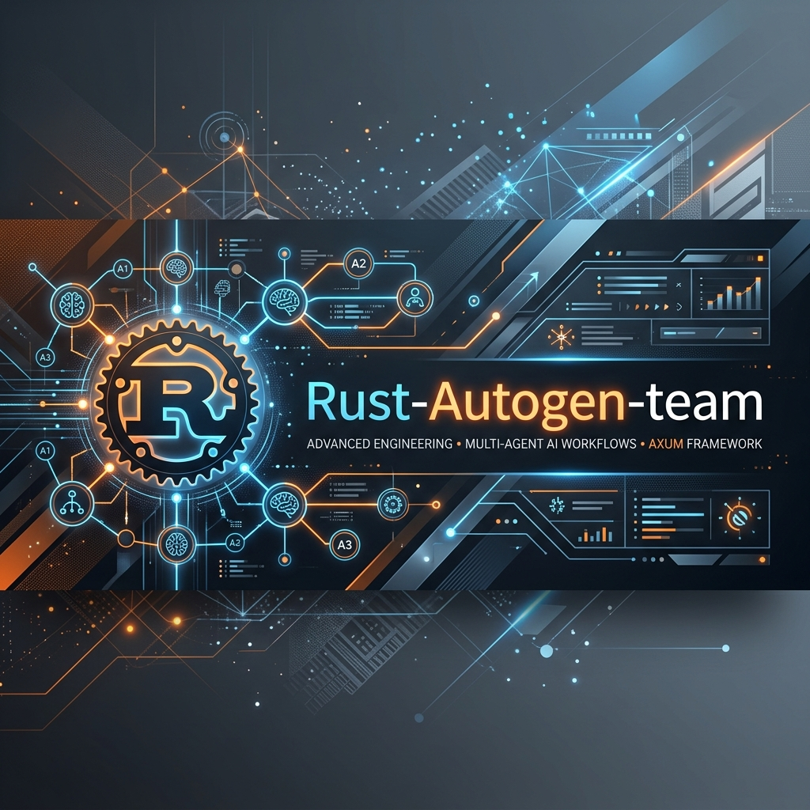
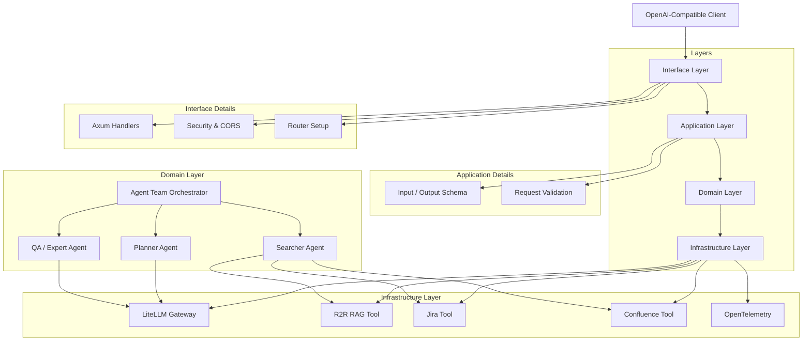
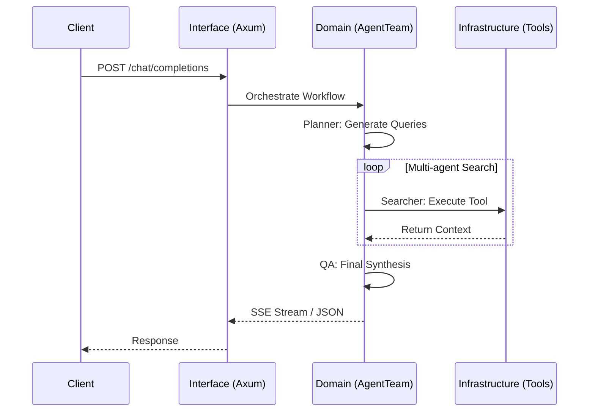

# Rust-Agent-team Service

[](https://github.com/lgcorzo/fastapi-agent-team/actions/workflows/check.yml)
[](https://github.com/lgcorzo/fastapi-agent-team/blob/main/LICENCE.txt)
[](https://github.com/lgcorzo/fastapi-agent-team/releases)

**This repository contains a high-performance Rust service designed as an MLOps template application following Domain-Driven Design (DDD) principles.** Originally a Python/FastAPI project using Microsoft's AutoGen, it has been fully refactored into a native Rust implementation using the [Axum](https://github.com/tokio-rs/axum) web framework and the [Rig](https://github.com/0xPlayground/rig) LLM orchestration library.

It provides an OpenAI-compatible streaming interface for multi-agent workflows, leveraging **Qwen 2.5 7B** (running via Ollama and LiteLLM) to deliver fast and reliable reasoning.

# Table of Contents

- [Rust-Agent Team-team Service](#rust-agent-team-service)
- [Table of Contents](#table-of-contents)
- [Overview](#overview)
- [Architecture](#architecture)
    - [DDD Layered Structure](#ddd-layered-structure)
    - [Request Flow](#request-flow)
- [Project Structure](#project-structure)
- [Installation](#installation)
- [Configuration](#configuration)
- [Usage](#usage)
- [Testing](#testing)
- [Development in Kubernetes](#development-in-kubernetes)
- [References](#references)

# Overview

The project facilitates complex LLM orchestration through a "Team" of agents:
1. **Planner**: Breaks down user requests into actionable search queries.
2. **Searcher**: Executes searches across integrated tools (R2R, Jira, and Confluence).
3. **QA/Expert**: Synthesizes search results into a final answer.

# Architecture

The system is built on **Domain-Driven Design (DDD)** principles to ensure a clear separation of concerns and a highly maintainable codebase.

### DDD Layered Structure


```mermaid
graph TD
    Client[OpenAI-Compatible Client] --> Interface[Interface Layer]
    
    subgraph Layers
        Interface --> Application[Application Layer]
        Application --> Domain[Domain Layer]
        Domain --> Infrastructure[Infrastructure Layer]
    end

    subgraph Interface Details
        Interface --> Handlers[Axum Handlers]
        Interface --> Middleware[Security & CORS]
        Interface --> Routes[Router Setup]
    end

    subgraph Application Details
        Application --> DTOs[Input / Output Schema]
        Application --> Validation[Request Validation]
    end

    subgraph Domain Layer
        AgentTeam[Agent Team Orchestrator]
        AgentTeam --> Planner[Planner Agent]
        AgentTeam --> Searcher[Searcher Agent]
        AgentTeam --> QA[QA / Expert Agent]
    end

    subgraph Infrastructure Layer
        Infrastructure --> LiteLLM[LiteLLM Gateway]
        Infrastructure --> R2R[R2R RAG Tool]
        Infrastructure --> Jira[Jira Tool]
        Infrastructure --> Confluence[Confluence Tool]
        Infrastructure --> Telemetry[OpenTelemetry]
    end

    %% Dependencies
    Planner --> LiteLLM
    Searcher --> R2R
    Searcher --> Jira
    Searcher --> Confluence
    QA --> LiteLLM
```

### Request Flow


```mermaid
sequenceDiagram
    participant C as Client
    participant I as Interface (Axum)
    participant D as Domain (AgentTeam)
    participant Inf as Infrastructure (Tools)

    C->>I: POST /chat/completions
    I->>D: Orchestrate Workflow
    D->>D: Planner: Generate Queries
    loop Multi-agent Search
        D->>Inf: Searcher: Execute Tool
        Inf-->>D: Return Context
    end
    D->>D: QA: Final Synthesis
    D-->>I: SSE Stream / JSON
    I-->>C: Response
```

# Project Structure

```text
src/
├── application/         # DTOs and Shared Models
├── domain/              # Core Business Logic & Orchestration
├── infrastructure/      # External Clients & Tools
├── interface/           # HTTP Boundary
├── lib.rs               # Library Entry Point
└── main.rs              # Application Entry Point

tests/                   # DDD Testing Suite
├── unit/                # Isolated Component Tests (Domain, App, Infra)
├── integration/         # Multi-component API & Workflow Tests
│   ├── tools.rs         # Specific tests for R2R, Jira, and Confluence tools
│   └── ...
├── smoke/               # Zero-mock Production Tests
├── security/            # Security, Auth, and Sanitization Tests
├── common/              # Shared Test Utilities
├── unit_tests.rs        # Unit Test Suite Entry Point
└── integration_tests.rs # Integration Test Suite Entry Point
```

# Installation

### Prerequisites

- [Rust](https://www.rust-lang.org/tools/install) (latest stable)
- Cargo

### Setup

1.  **Clone the repository**:
    ```bash
    git clone https://github.com/lgcorzo/fastapi-agent-team.git
    cd fastapi-agent-team
    ```

2.  **Install dependencies**:
    ```bash
    sudo apt-get update
    sudo apt-get install -y build-essential pkg-config libssl-dev
    ```

3.  **Build the project**:
    ```bash
    cargo build --release
    ```

4.  **Run the service**:
    ```bash
    cargo run
    ```
    The server will start on `http://127.0.0.1:4100` by default.

# Configuration

The service is configured via environment variables. Create a `.env` file or export them directly:

| Variable | Description |
|----------|-------------|
| `LITELLM_API_KEY` | API Key for the LLM backend (LiteLLM/OpenAI) |
| `LITELLM_BASE_URL` | Base URL for the LLM API |
| `R2R_URL` | URL for the R2R backend |
| `R2R_USER` | R2R Username |
| `R2R_PWD` | R2R Password |
| `JIRA_INSTANCE_URL` | Your Atlassian Cloud URL (e.g., https://site.atlassian.net) |
| `JIRA_USERNAME` | Atlassian account email (used for Jira & Confluence) |
| `JIRA_API_TOKEN` | Atlassian API Token (used for Jira & Confluence) |
| `ALLOWED_ORIGINS` | Comma-separated list of allowed CORS origins |

# Usage

### Chat Completions

```bash
curl -X POST "http://localhost:4100/agent/api/v1beta/chat/completions" \
     -H "Content-Type: application/json" \
     -d '{
       "model": "qwen2.5:7b",
       "messages": [{"role": "user", "content": "Search for progress on EPIC-123 in Jira, related docs in R2R, and design specs in Confluence."}]
     }'
```

### Models Information

```bash
curl http://localhost:4100/agent/api/v1beta/models
```

# Testing and Quality Assurance

The project follows a **Domain-Driven Design (DDD)** testing strategy, separating concerns into four distinct categories:

### 1. Unit Tests
Isolated tests for individual components (Domain logic, DTOs, Tool mapping) with full mocking of dependencies.
```bash
cargo test --test unit_tests
```

### 2. Integration Tests
Verifies multi-component interactions and API contracts. Only external services are mocked using Mockito.
```bash
cargo test --test integration_tests
```

### 3. Security Tests
Focused on security headers, CORS policies, and input sanitization (payload size limits, JSON injection, empty content).
```bash
cargo test --test integration_tests security
```

### 4. Production Smoke Tests
Zero-mock tests that verify live connectivity to LLM, Jira, and R2R. **Warning: Consumes real tokens.**
```bash
cargo test --test integration_tests smoke -- --ignored --nocapture
```

### 5. Kubernetes-Only Production Tests
Production-grade tests designed to run specifically inside a Kubernetes cluster to verify real agent tool connectivity to R2R, JIRA, and Confluence via the live streaming chat completions API. These tests automatically skip when run outside a Kubernetes cluster.
```bash
cargo test --test integration_tests smoke::kubernetes -- --ignored --nocapture
```

### 6. Mock Services for Local Debugging
To debug tool interactions locally without connecting to real services, you can run the standalone mock server:
```bash
./scripts/start_mocks.sh
```
This script starts a mock server on port 8081 and provides the necessary environment variables to point the main application to it.

### Recommended Order
For new developers, we recommend running the suites in the following order:
1. `unit_tests`
2. `integration_tests` (Standard)
3. `integration_tests` (Security)
4. `integration_tests` (Smoke)
5. `integration_tests` (Kubernetes-Only Smoke)

### Running Everything (Standard)
To run all suites (excluding ignored smoke tests):
```bash
cargo test
```

# Automated Checks (CI)

This project uses GitHub Actions to ensure code quality and stability. Every pull request and push to the `main` branch triggers the following checks:

1.  **Format Check**: Ensures all code follows the Rust standard formatting.
    ```bash
    cargo fmt --check
    ```
2.  **Linting**: Uses Clippy to catch common mistakes and enforce best practices across all targets (library, binary, and tests).
    ```bash
    cargo clippy --all-targets -- -D warnings
    ```
3.  **Tests**: Executes the full unit and integration test suite (excluding smoke tests).
    ```bash
    cargo test --test unit_tests --test integration_tests
    ```


### Debugging

- **Logging**: The application uses `tracing`. Control log verbosity with `RUST_LOG`:
  ```bash
  RUST_LOG=debug cargo run
  ```
- **Backtraces**: For detailed error stack traces:
  ```bash
  RUST_BACKTRACE=1 cargo run
  ```
- **Live Logs**: If running in the background, monitor `server.log`:
  ```bash
  tail -f server.log
  ```

# Deployment


### Kubernetes

The service is optimized for Kubernetes. Ensure environment variables (see [Configuration](#configuration)) are provided via ConfigMaps or Secrets.

# Development in Kubernetes

To develop directly inside your Kubernetes cluster, we recommend using [Okteto](https://www.okteto.com/).

1.  **Start Development Mode**: `okteto up`
2.  **Inside the Okteto shell**: `cargo run`

# References

- [Rig Documentation](https://0xplayground.github.io/rig/)
- [Axum Documentation](https://docs.rs/axum/latest/axum/)
- [LiteLLM](https://docs.litellm.ai/)
