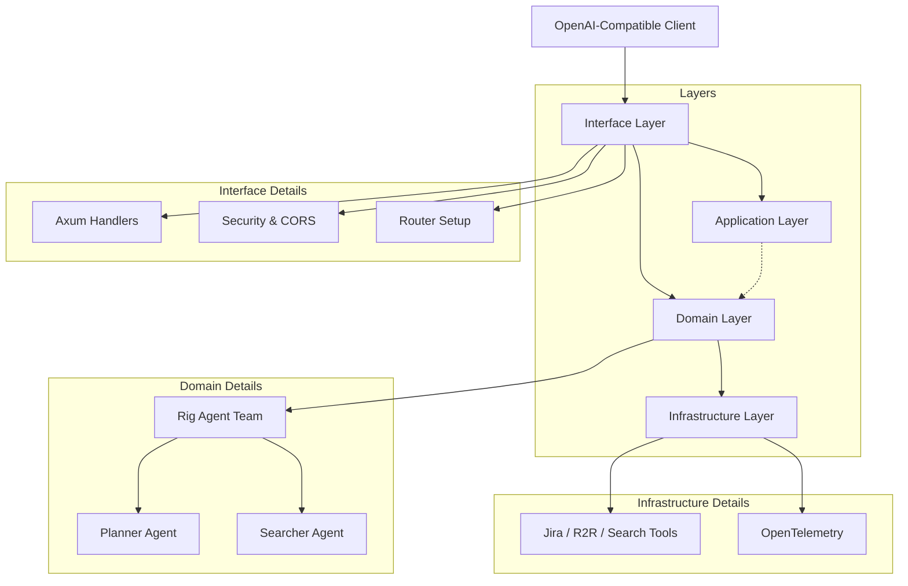
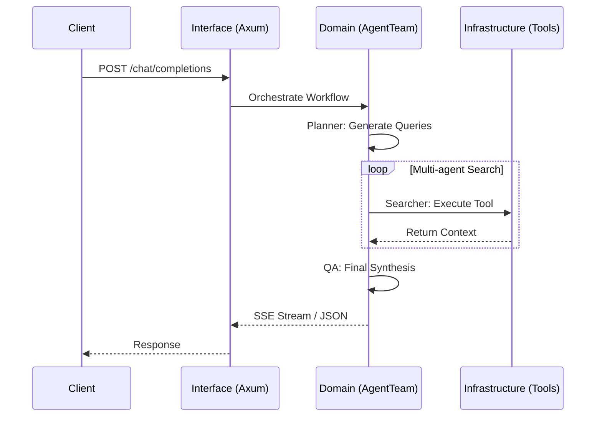

# Fastapi-Autogen-team Rust Service

[](https://github.com/lgcorzo/fastapi-autogen-team/actions/workflows/check.yml)
[](https://github.com/lgcorzo/fastapi-autogen-team/blob/main/LICENCE.txt)
[](https://github.com/lgcorzo/fastapi-autogen-team/releases)

**This repository contains a high-performance Rust service designed as an MLOps template application following Domain-Driven Design (DDD) principles.** It uses the [Axum](https://github.com/tokio-rs/axum) web framework and the [Rig](https://github.com/0xPlayground/rig) LLM orchestration library.

It provides an OpenAI-compatible streaming interface for multi-agent workflows, enabling real-time interactions suitable for LiteLLM and other OpenAI-compatible integrations.

# Table of Contents

- [Fastapi-Autogen-team Rust Service](#fastapi-autogen-team-rust-service)
- [Table of Contents](#table-of-contents)
- [Overview](#overview)
- [Architecture](#architecture)
    - [DDD Layered Structure](#ddd-layered-structure)
    - [Request Flow](#request-flow)
- [Project Structure](#project-structure)
- [Installation](#installation)
- [Configuration](#configuration)
- [Usage](#usage)
- [Testing](#testing)
- [Development in Kubernetes](#development-in-kubernetes)
- [References](#references)

# Overview

The project facilitates complex LLM orchestration through a "Team" of agents:
1. **Planner**: Breaks down user requests into actionable search queries.
2. **Searcher**: Executes searches across integrated tools (R2R and Jira).
3. **QA/Expert**: Synthesizes search results into a final answer.

# Architecture

The system is built on **Domain-Driven Design (DDD)** principles to ensure a clear separation of concerns and a highly maintainable codebase.

### DDD Layered Structure


```mermaid
graph TD
    Client[OpenAI-Compatible Client] --> Interface[Interface Layer]
    
    subgraph Layers
        Interface --> Application[Application Layer]
        Interface --> Domain[Domain Layer]
        Domain --> Infrastructure[Infrastructure Layer]
        Application -.-> Domain
    end

    subgraph Interface Details
        Interface --> Handlers[Axum Handlers]
        Interface --> Middleware[Security & CORS]
        Interface --> Routes[Router Setup]
    end

    subgraph Domain Details
        Domain --> AgentTeam[Rig Agent Team]
        AgentTeam --> Planner[Planner Agent]
        AgentTeam --> Searcher[Searcher Agent]
    end

    subgraph Infrastructure Details
        Infrastructure --> Tools[Jira / R2R / Search Tools]
        Infrastructure --> Telemetry[OpenTelemetry]
    end
```

### Request Flow


```mermaid
sequenceDiagram
    participant C as Client
    participant I as Interface (Axum)
    participant D as Domain (AgentTeam)
    participant Inf as Infrastructure (Tools)

    C->>I: POST /chat/completions
    I->>D: Orchestrate Workflow
    D->>D: Planner: Generate Queries
    loop Multi-agent Search
        D->>Inf: Searcher: Execute Tool
        Inf-->>D: Return Context
    end
    D->>D: QA: Final Synthesis
    D-->>I: SSE Stream / JSON
    I-->>C: Response
```

# Project Structure

```text
src/
├── application/         # DTOs and Shared Models
│   └── dtos.rs
├── domain/              # Core Business Logic & Orchestration
│   └── agent/
│       └── team.rs      # AgentTeam implementation
├── infrastructure/      # External Clients & Tools
│   ├── tools/           # Jira, R2R, SearchTool
│   └── telemetry.rs     # OTEL Setup
├── interface/           # HTTP Boundary
│   └── http/
│       ├── handlers.rs  # Axum Handlers
│       ├── middleware.rs# Security/CORS
│       └── routes.rs    # Router & AppState
├── lib.rs               # Library Entry Point
└── main.rs              # Application Entry Point
```

# Installation

### Prerequisites

- [Rust](https://www.rust-lang.org/tools/install) (latest stable)
- Cargo

### Setup

1.  **Clone the repository**:
    ```bash
    git clone https://github.com/lgcorzo/fastapi-autogen-team.git
    cd fastapi-autogen-team
    ```

2.  **Install dependencies**:
    ```bash
    sudo apt-get update
    sudo apt-get install -y build-essential pkg-config libssl-dev
    ```

3.  **Build the project**:
    ```bash
    cargo build --release
    ```

4.  **Run the service**:
    ```bash
    cargo run
    ```
    The server will start on `http://127.0.0.1:4100` by default.

# Configuration

The service is configured via environment variables. Create a `.env` file or export them directly:

| Variable | Description |
|----------|-------------|
| `LITELLM_API_KEY` | API Key for the LLM backend (LiteLLM/OpenAI) |
| `LITELLM_BASE_URL` | Base URL for the LLM API |
| `R2R_URL` | URL for the R2R backend |
| `R2R_USER` | R2R Username |
| `R2R_PWD` | R2R Password |
| `JIRA_INSTANCE_URL` | Your Jira Cloud URL (e.g., https://site.atlassian.net) |
| `JIRA_USERNAME` | Jira account email |
| `JIRA_API_TOKEN` | Jira API Token |
| `ALLOWED_ORIGINS` | Comma-separated list of allowed CORS origins |

# Usage

### Chat Completions

```bash
curl -X POST "http://localhost:4100/autogen/api/v1beta/chat/completions" \
     -H "Content-Type: application/json" \
     -d '{
       "model": "gpt-4o",
       "messages": [{"role": "user", "content": "Search for progress on EPIC-123 in Jira and related docs in R2R."}]
     }'
```

### Models Information

```bash
curl http://localhost:4100/autogen/api/v1beta/models
```

# Testing and Debugging

### Running Tests

To run all tests (unit, integration, and security):
```bash
cargo test
```

To run a specific test file:
```bash
cargo test --test security_tests
```

### Debugging

- **Logging**: The application uses `tracing`. Control log verbosity with `RUST_LOG`:
  ```bash
  RUST_LOG=debug cargo run
  ```
- **Backtraces**: For detailed error stack traces:
  ```bash
  RUST_BACKTRACE=1 cargo run
  ```
- **Live Logs**: If running in the background, monitor `server.log`:
  ```bash
  tail -f server.log
  ```

# Deployment

### Docker

1. **Build the image**:
   ```bash
   docker build -t fastapi-autogen-team .
   ```

2. **Run the container**:
   ```bash
   docker run -p 4100:4100 --env-file .env fastapi-autogen-team
   ```

### Kubernetes

The service is optimized for Kubernetes. Ensure environment variables (see [Configuration](#configuration)) are provided via ConfigMaps or Secrets.

# Development in Kubernetes

To develop directly inside your Kubernetes cluster, we recommend using [Okteto](https://www.okteto.com/).

1.  **Start Development Mode**: `okteto up`
2.  **Inside the Okteto shell**: `cargo run`

# References

- [Rig Documentation](https://0xplayground.github.io/rig/)
- [Axum Documentation](https://docs.rs/axum/latest/axum/)
- [LiteLLM](https://docs.litellm.ai/)
