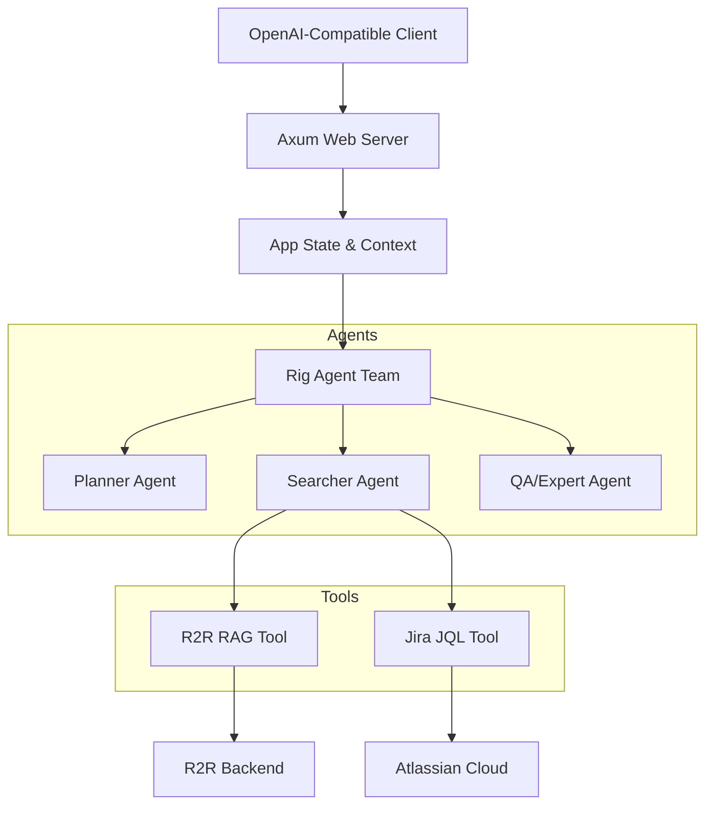
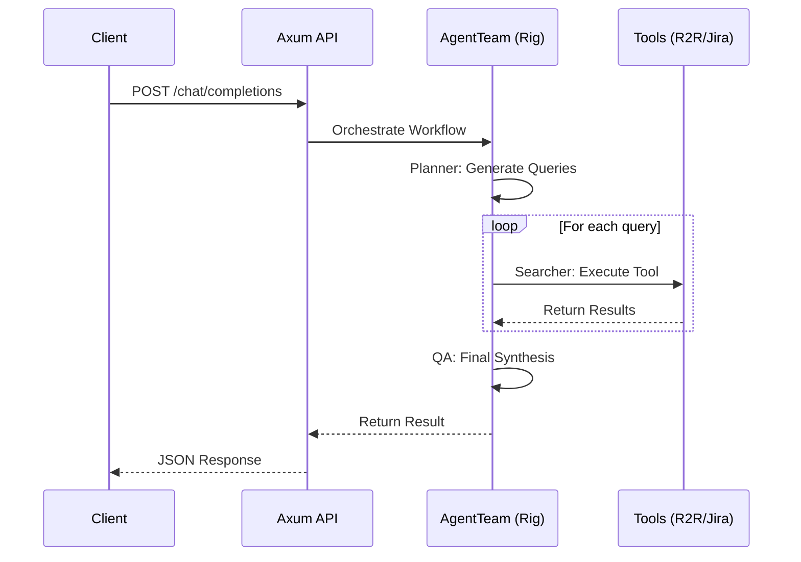

# Fastapi-Autogen-team Rust Service

[](https://github.com/lgcorzo/fastapi-autogen-team/actions/workflows/check.yml)
[](https://github.com/lgcorzo/fastapi-autogen-team/blob/main/LICENCE.txt)
[](https://github.com/lgcorzo/fastapi-autogen-team/releases)

**This repository contains a high-performance Rust service designed as an MLOps template application using the [Axum](https://github.com/tokio-rs/axum) web framework and the [Rig](https://github.com/0xPlayground/rig) LLM orchestration library.**

It provides an OpenAI-compatible streaming interface for multi-agent workflows, enabling real-time interactions suitable for LiteLLM and other OpenAI-compatible integrations.

# Table of Contents

- [Fastapi-Autogen-team Rust Service](#fastapi-autogen-team-rust-service)
- [Table of Contents](#table-of-contents)
- [Overview](#overview)
- [Architecture](#architecture)
    - [Component Diagram](#component-diagram)
    - [Sequence Flow](#sequence-flow)
- [Installation](#installation)
    - [Prerequisites](#prerequisites)
    - [Setup](#setup)
- [Configuration](#configuration)
- [Usage](#usage)
    - [Chat Completions](#chat-completions)
    - [Models Information](#models-information)
- [Testing](#testing)
- [Development in Kubernetes](#development-in-kubernetes)
- [References](#references)

# Overview

The project facilitates complex LLM orchestration through a "Team" of agents:
1. **Planner**: Breaks down user requests into actionable search queries.
2. **Searcher**: Executes searches across integrated tools (R2R and Jira).
3. **QA/Expert**: Synthesizes search results into a final answer.

# Architecture

The system uses a layered approach for reliability and performance.

### Component Diagram


```mermaid
graph TD
    Client[OpenAI-Compatible Client] --> Axum[Axum Web Server]
    Axum --> AppState[App State & Context]
    AppState --> AgentTeam[Rig Agent Team]
    
    subgraph Agents
        AgentTeam --> Planner[Planner Agent]
        AgentTeam --> Searcher[Searcher Agent]
        AgentTeam --> QA[QA/Expert Agent]
    end

    subgraph Tools
        Searcher --> R2R[R2R RAG Tool]
        Searcher --> Jira[Jira JQL Tool]
    end

    R2R --> R2RBkd[R2R Backend]
    Jira --> JiraBkd[Atlassian Cloud]
```

### Sequence Flow


```mermaid
sequenceDiagram
    participant C as Client
    participant A as Axum API
    participant AT as AgentTeam (Rig)
    participant T as Tools (R2R/Jira)

    C->>A: POST /chat/completions
    A->>AT: Orchestrate Workflow
    AT->>AT: Planner: Generate Queries
    loop For each query
        AT->>T: Searcher: Execute Tool
        T-->>AT: Return Results
    end
    AT->>AT: QA: Final Synthesis
    AT-->>A: Return Result
    A-->>C: JSON Response
```

# Installation

### Prerequisites

- [Rust](https://www.rust-lang.org/tools/install) (latest stable)
- Cargo

### Setup

1.  **Clone the repository**:
    ```bash
    git clone https://github.com/lgcorzo/fastapi-autogen-team.git
    cd fastapi-autogen-team
    ```

2.  **Build the project**:
    ```bash
    cargo build --release
    ```

3.  **Run the service**:
    ```bash
    cargo run
    ```

# Configuration

The service is configured via environment variables. Create a `.env` file or export them directly:

| Variable | Description |
|----------|-------------|
| `LITELLM_API_KEY` | API Key for the LLM backend (LiteLLM/OpenAI) |
| `LITELLM_BASE_URL` | Base URL for the LLM API |
| `R2R_URL` | URL for the R2R backend |
| `R2R_USER` | R2R Username |
| `R2R_PWD` | R2R Password |
| `JIRA_INSTANCE_URL` | Your Jira Cloud URL (e.g., https://site.atlassian.net) |
| `JIRA_USERNAME` | Jira account email |
| `JIRA_API_TOKEN` | Jira API Token |

# Usage

### Chat Completions

```bash
curl -X POST "http://localhost:8000/autogen/api/v1beta/chat/completions" \
     -H "Content-Type: application/json" \
     -d '{
       "model": "gpt-4o",
       "messages": [{"role": "user", "content": "Search for progress on EPIC-123 in Jira and related docs in R2R."}]
     }'
```

### Models Information

```bash
curl http://localhost:8000/autogen/api/v1beta/models
```

# Testing

The project includes a robust testing suite covering unit tests for tools and agents, as well as integration tests for the API layer.

```bash
# Run all tests
cargo test

# Run tests with output
cargo test -- --nocapture
```

We use `mockito` to isolate external dependencies (LiteLLM, Jira, R2R) during testing.

# Development in Kubernetes

To develop directly inside your Kubernetes cluster, we recommend using [Okteto](https://www.okteto.com/).

1.  **Start Development Mode**:
    ```bash
    okteto up
    ```
2.  **Inside the Okteto shell**:
    ```bash
    cargo run
    ```

# References

- [Rig Documentation](https://0xplayground.github.io/rig/)
- [Axum Documentation](https://docs.rs/axum/latest/axum/)
- [LiteLLM](https://docs.litellm.ai/)
