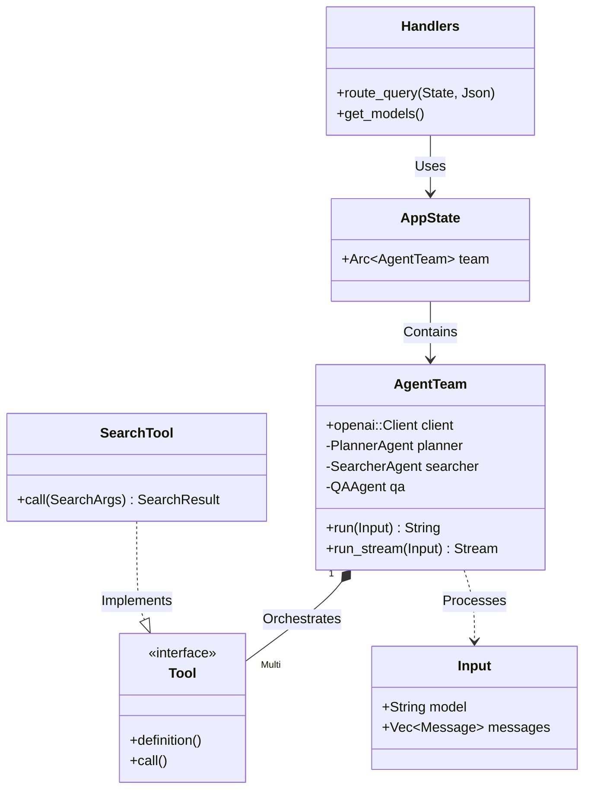
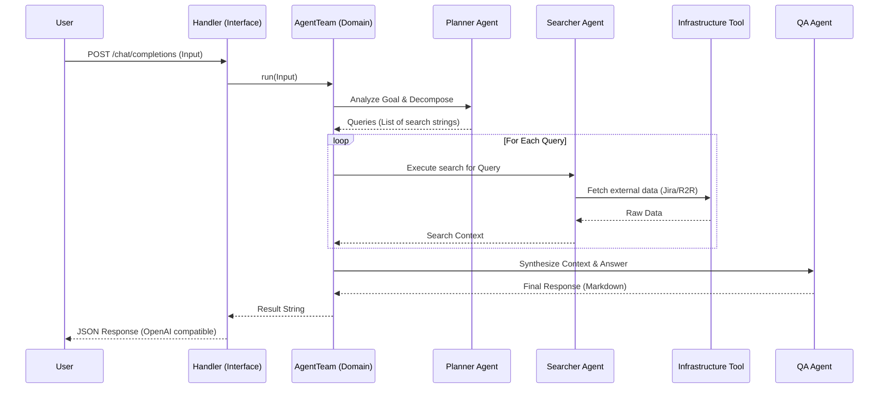
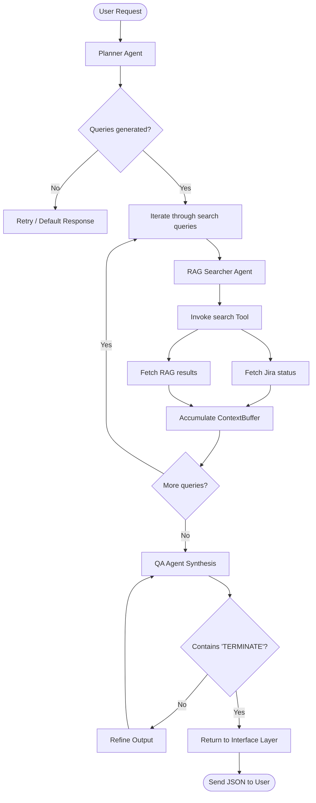

# Detailed Architecture Guide

This document explains the relationship between the various elements of the `fastapi-autogen-team` project, following the **Domain-Driven Design (DDD)** standard.

## DDD Layer Mapping

The project is structured into four distinct layers to ensure a clean separation of concerns and maintainability.

### 1. Interface Layer (`src/interface/`)
Handles the communication with external clients (REST API). 
- **`handlers.rs`**: Processes incoming HTTP requests and delegates work to the Domain layer.
- **`routes.rs`**: Manages the application router and state.
- **`middleware.rs`**: Implements security headers, CORS, and request sanitization.

### 2. Application Layer (`src/application/`)
Defines the data formats and transformations used within the application.
- **`dtos.rs`**: Data Transfer Objects (DTOs) that represent the API contracts (OpenAI-compatible).

### 3. Domain Layer (`src/domain/`)
The core of the system. Contains the business logic and orchestrates the multi-agent team.
- **`AgentTeam`**: The central aggregate that coordinates the Planner, Searcher, and QA agents to solve user queries.

### 4. Infrastructure Layer (`src/infrastructure/`)
Provides technical capabilities and interfaces with external services.
- **`tools/`**: Contains the specific implementation for Jira and R2R search tools.
- **`telemetry.rs`**: Handles observability (OpenTelemetry, tracing).

---

## Structural UML (Class Diagram)

This diagram shows the structural relationship between the core components of the service.

---

## Execution Flow (Sequence Diagram)

This diagram details the lifecycle of a single query through the multi-agent system.

---

## Multi-Agent Workflow (Flowchart)

A detailed look at the decision logic within the `AgentTeam`.

