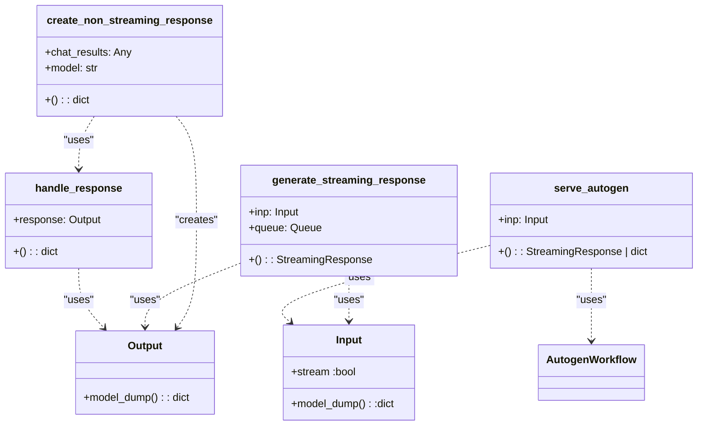

# US [Autogen Server](./backlog_mlops_regresion.md) : Serve Autogen workflows via FastAPI endpoints.

- [US Autogen Server : Serve Autogen workflows via FastAPI endpoints.](#us-autogen-server--serve-autogen-workflows-via-fastapi-endpoints)
  - [classes relations](#classes-relations)
  - [**User Stories: Autogen Server Management**](#user-stories-autogen-server-management)
    - [**1. User Story: Handle Responses from Autogen Workflow**](#1-user-story-handle-responses-from-autogen-workflow)
    - [**2. User Story: Serve Autogen Workflow**](#2-user-story-serve-autogen-workflow)
    - [**3. User Story: Generate Streaming Response**](#3-user-story-generate-streaming-response)
    - [**4. User Story: Create Non-Streaming Response**](#4-user-story-create-non-streaming-response)
    - [**Common Acceptance Criteria**](#common-acceptance-criteria)
    - [**Definition of Done (DoD):**](#definition-of-done-dod)
  - [Code location](#code-location)
  - [Test location](#test-location)

------------

## classes relations

## **User Stories: Autogen Server Management**

---

### **1. User Story: Handle Responses from Autogen Workflow**

**Title:** As a **developer**, I want to handle responses from the Autogen workflow, validating their structure and serializing them for API delivery, so that I can ensure the API returns valid and consistent data.

**Description:** The `handle_response` function validates and processes the response object from the Autogen workflow, ensuring it's of the expected type and has the required attributes before serialization.

**Acceptance Criteria:**

- The function raises an `HTTPException` with a 500 status code if the response is a string.
- The function raises an `HTTPException` with a 500 status code if the response object does not have a `model_dump` method.
- The function returns a dictionary representation of the response object if it passes validation.
- Any serialization errors are caught, logged, and re-raised as `HTTPException` with a 500 status code.

---

### **2. User Story: Serve Autogen Workflow**

**Title:** As a **user**, I want to access the Autogen workflow via an API endpoint, so that I can trigger the workflow and receive its results in either streaming or non-streaming format.

**Description:** The `serve_autogen` function serves the Autogen workflow based on the provided input, supporting both streaming and non-streaming responses.

**Acceptance Criteria:**

- The function accepts an `Input` object as input.
- If `inp.stream` is True, the function returns a `StreamingResponse`.
- If `inp.stream` is False, the function returns a dictionary.
- The function uses the `AutogenWorkflow` class to execute the workflow.
- Exceptions during Autogen processing are caught, logged, and re-raised as `HTTPException` with a 500 status code.

---

### **3. User Story: Generate Streaming Response**

**Title:** As a **developer**, I want to generate a streaming response from the Autogen workflow, so that I can provide real-time updates to the user as the workflow progresses.

**Description:** The `generate_streaming_response` function generates a streaming response from the message queue, yielding data chunks as they become available.

**Acceptance Criteria:**

- The function accepts an `Input` object and a `Queue` object as input.
- The function yields data chunks in the format ` {json.dumps(handle_response(chunk))}\n\n`.
- The function yields a final chunk ` [DONE]\n\n` when the workflow is complete.
- The function handles exceptions during streaming, logging, and re-raising them as `HTTPException` with a 500 status code.

---

### **4. User Story: Create Non-Streaming Response**

**Title:** As a **developer**, I want to create a non-streaming response from the Autogen workflow, so that I can provide a complete result to the user once the workflow has finished.

**Description:** The `create_non_streaming_response` function creates a non-streaming response from the chat results, formatting the output according to the expected schema.

**Acceptance Criteria:**

- The function accepts chat results and a model name as input.
- If `chat_results` are available, the function formats them into a structured `Output` object.
- If `chat_results` are not available, the function creates a default error message.
- The function uses the `handle_response` function to process the output.
- Any exceptions are caught, logged, and re-raised as `HTTPException` with a 500 status code.

---

### **Common Acceptance Criteria**

1. **Implementation Requirements:**
   - All functions are correctly implemented as per the descriptions.
   - The code adheres to Python coding standards.

2. **Error Handling:**
   - All functions include appropriate error handling, logging exceptions, and raising HTTPExceptions with 500 status code.

3. **Testing:**
   - Unit tests validate the functionality of all functions, covering both success and error scenarios.

4. **Documentation:**
   - Each function has a detailed docstring describing its purpose, parameters, and return value.

---

### **Definition of Done (DoD):**

- All functions (`handle_response`, `serve_autogen`, `generate_streaming_response`, `create_non_streaming_response`) are implemented and tested.
- All unit tests pass successfully.
- Code adheres to the project's coding standards and passes peer review.
- Documentation is complete and up-to-date.

## Code location

[src/fastapi_autogen_team/autogen_server.py](../src/fastapi_autogen_team/autogen_server.py)

## Test location

[tests/autogen_server.py](../tests/test_autogen_server.py)
