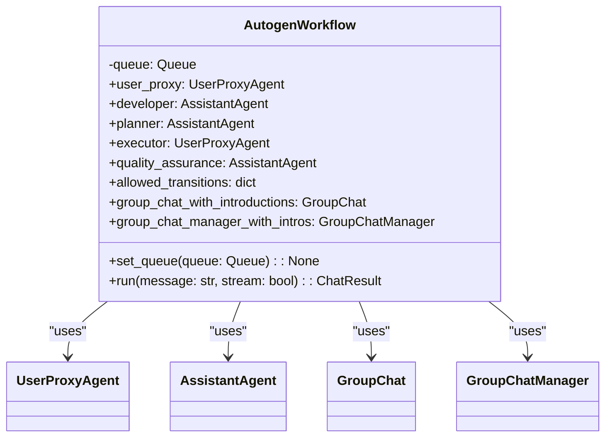

# US [Autogen Workflow Team Management](./backlog_mlops_regresion.md) : Orchestrate Autogen agents for collaborative problem-solving.

- [US Autogen Workflow Team Management : Orchestrate Autogen agents for collaborative problem-solving.](#us-autogen-workflow-team-management--orchestrate-autogen-agents-for-collaborative-problem-solving)
  - [classes relations](#classes-relations)
  - [**User Stories: Autogen Workflow Management**](#user-stories-autogen-workflow-management)
    - [**1. User Story: Configure LLM for Autogen Agents**](#1-user-story-configure-llm-for-autogen-agents)
    - [**2. User Story: Stream Messages from Agents**](#2-user-story-stream-messages-from-agents)
    - [**3. User Story: Handle Tool Responses**](#3-user-story-handle-tool-responses)
    - [**4. User Story: Handle Function and Tool Calls**](#4-user-story-handle-function-and-tool-calls)
    - [**5. User Story: Manage Regular Messages**](#5-user-story-manage-regular-messages)
    - [**6. User Story: Manage Suggested Function Calls**](#6-user-story-manage-suggested-function-calls)
    - [**7. User Story: Manage Suggested Tool Calls**](#7-user-story-manage-suggested-tool-calls)
    - [**8. User Story: Initialize Autogen Agents**](#8-user-story-initialize-autogen-agents)
    - [**9. User Story: Execute Autogen Workflow**](#9-user-story-execute-autogen-workflow)
    - [**Common Acceptance Criteria**](#common-acceptance-criteria)
    - [**Definition of Done (DoD):**](#definition-of-done-dod)
  - [Code location](#code-location)
  - [Test location](#test-location)

------------

## classes relations

## **User Stories: Autogen Workflow Management**

---

### **1. User Story: Configure LLM for Autogen Agents**

**Title:** As a **developer**, I want to configure the language model settings (temperature, API keys, etc.) for Autogen agents, so that I can control the behavior and performance of the agents.

**Description:** The `create_llm_config` function facilitates the configuration of language models for Autogen agents, allowing customization of settings such as temperature and API keys.

**Acceptance Criteria:**

- The `create_llm_config` function creates a valid LLM configuration dictionary.
- The function supports both default and custom configuration lists.
- The function includes parameters for temperature and timeout.

---

### **2. User Story: Stream Messages from Agents**

**Title:** As a **user**, I want to receive streamed messages from Autogen agents, so that I can see the agents' interactions in real-time.

**Description:** The `streamed_print_received_message` function prints messages received from Autogen agents with streaming support, providing a real-time view of agent interactions.

**Acceptance Criteria:**

- The `streamed_print_received_message` function prints messages with streaming support.
- The function formats messages to include sender information.
- The function places delta messages into the message queue.

---

### **3. User Story: Handle Tool Responses**

**Title:** As a **developer**, I want to handle tool responses from Autogen agents, so that the agent can execute tools effectively.

**Description:** The `handle_tool_responses` function manages messages containing tool responses, including printing and queuing.

**Acceptance Criteria:**

- The `handle_tool_responses` function handles tool responses correctly.
- The function processes multiple tool responses within a single message.

---

### **4. User Story: Handle Function and Tool Calls**

**Title:** As a **developer**, I want to handle function and tool calls from Autogen agents, so that the agent can execute functions effectively.

**Description:** The `handle_function_tool_message` function processes messages from function or tool calls, displaying the function name and arguments.

**Acceptance Criteria:**

- The `handle_function_tool_message` function handles function and tool calls.
- The function extracts and prints the function name and arguments.

---

### **5. User Story: Manage Regular Messages**

**Title:** As a **developer**, I want to manage regular messages from Autogen agents (not tool or function calls), so that I can process and display the content.

**Description:** The `handle_regular_message` function processes regular messages from Autogen agents, instantiating the content and handling function and tool calls.

**Acceptance Criteria:**

- The `handle_regular_message` function handles regular messages.
- The function supports context instantiation.
- The function handles function and tool calls embedded in regular messages.

---

### **6. User Story: Manage Suggested Function Calls**

**Title:** As a **developer**, I want to manage suggested function calls from Autogen agents, so that I can display the function name and arguments for user confirmation.

**Description:** The `handle_suggested_function_call` function processes suggested function calls, displaying the function name and arguments for user confirmation.

**Acceptance Criteria:**

- The `handle_suggested_function_call` function handles suggested function calls.
- The function extracts and prints the function name and arguments.

---

### **7. User Story: Manage Suggested Tool Calls**

**Title:** As a **developer**, I want to manage suggested tool calls from Autogen agents, so that I can display the tool name and arguments for user confirmation.

**Description:** The `handle_suggested_tool_calls` function processes suggested tool calls, displaying the tool name and arguments for user confirmation.

**Acceptance Criteria:**

- The `handle_suggested_tool_calls` function handles suggested tool calls.
- The function extracts and prints the tool name and arguments.

---

### **8. User Story: Initialize Autogen Agents**

**Title:** As a **developer**, I want to initialize a set of Autogen agents (UserProxy, Developer, Planner, Executor, Quality Assurance) with predefined roles and configurations, so that I can create a collaborative team for problem-solving.

**Description:** The `AutogenWorkflow` class initializes a set of Autogen agents with specific roles and system messages, enabling collaborative problem-solving.

**Acceptance Criteria:**

- The `AutogenWorkflow` class creates instances of UserProxyAgent, AssistantAgent, and GroupChatManager.
- Each agent is initialized with specific roles, system messages, and configurations.
- Agent transitions are properly defined.

---

### **9. User Story: Execute Autogen Workflow**

**Title:** As a **user**, I want to execute the Autogen workflow with a given message, so that I can initiate the collaborative problem-solving process.

**Description:** The `run` method initiates the Autogen workflow, passing a message to the user proxy and returning the chat history.

**Acceptance Criteria:**

- The `run` method initiates the Autogen workflow.
- The workflow can be executed in both streaming and non-streaming modes.
- The function returns the chat history.
---

### **Common Acceptance Criteria**

1. **Implementation Requirements:**
   - All functions and classes are correctly implemented as per the descriptions.
   - The code adheres to Python coding standards.

2. **Error Handling:**
   - Appropriate error handling is implemented for exceptions and edge cases.

3. **Testing:**
   - Unit tests validate the functionality of all functions and classes.

4. **Documentation:**
   - Clear docstrings are provided for all functions and classes.

---

### **Definition of Done (DoD):**

- All functions and classes are implemented and tested.
- Unit tests cover all functionalities.
- Code adheres to project's coding standards and passes peer review.
- Documentation is complete and up-to-date.

## Code location

[src/fastapi_autogen_team/autogen_workflow_team.py](../src/fastapi_autogen_team/autogen_workflow_team.py)

## Test location

[tests/core/test_schemas.py](../tests/test_autogen_workflow_team.py)
