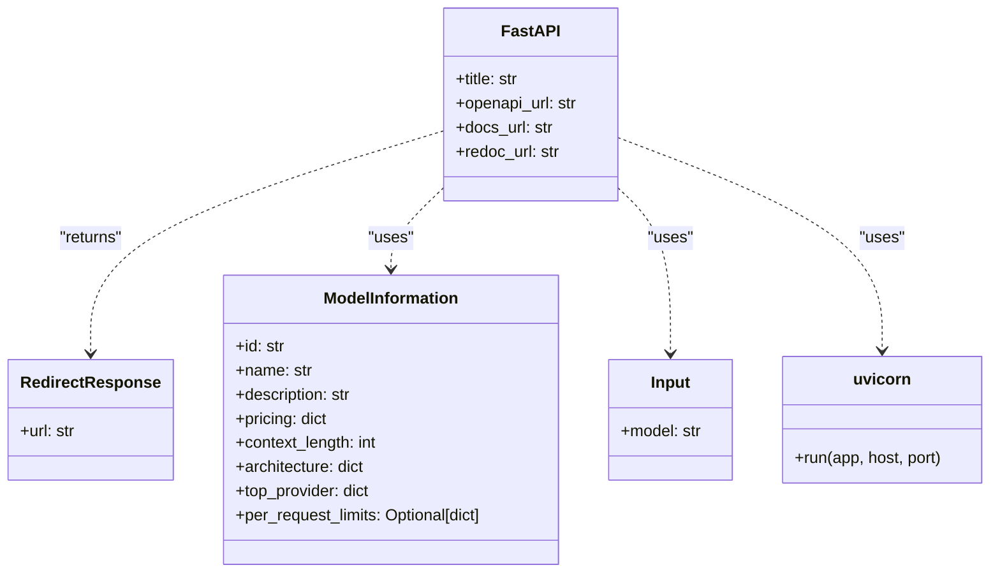

# US [FastAPI Application for Autogen Service](./backlog_mlops_regresion.md) : Run a FastAPI application that serves Autogen workflows with logging, tracing, and metrics.

- [US FastAPI Application for Autogen Service : Run a FastAPI application that serves Autogen workflows with logging, tracing, and metrics.](#us-fastapi-application-for-autogen-service--run-a-fastapi-application-that-serves-autogen-workflows-with-logging-tracing-and-metrics)
  - [classes relations](#classes-relations)
  - [**User Stories: FastAPI Application Management**](#user-stories-fastapi-application-management)
    - [**1. User Story: Configure Application Settings from Environment Variables**](#1-user-story-configure-application-settings-from-environment-variables)
    - [**2. User Story: Set Up OpenTelemetry Tracing**](#2-user-story-set-up-opentelemetry-tracing)
    - [**3. User Story: Set Up OpenTelemetry Metrics**](#3-user-story-set-up-opentelemetry-metrics)
    - [**4. User Story: Configure Logging with OpenTelemetry**](#4-user-story-configure-logging-with-opentelemetry)
    - [**5. User Story: Define Logging with Tracing Support**](#5-user-story-define-logging-with-tracing-support)
    - [**6. User Story: Implement Heartbeat Monitoring**](#6-user-story-implement-heartbeat-monitoring)
    - [**7. User Story: Define Model Information**](#7-user-story-define-model-information)
    - [**8. User Story: Define API Endpoints**](#8-user-story-define-api-endpoints)
    - [**9. User Story: Schedule Heartbeat Task**](#9-user-story-schedule-heartbeat-task)
    - [**10. User Story: Run the FastAPI Application**](#10-user-story-run-the-fastapi-application)
    - [**Common Acceptance Criteria**](#common-acceptance-criteria)
    - [**Definition of Done (DoD):**](#definition-of-done-dod)
  - [Code location](#code-location)
  - [Test location](#test-location)

------------

## classes relations

## **User Stories: FastAPI Application Management**

---

### **1. User Story: Configure Application Settings from Environment Variables**

**Title:** As a **system administrator**, I want to configure the FastAPI application using environment variables, so that I can easily manage settings across different environments.

**Description:** The application reads configuration settings from environment variables, allowing for flexible deployment and configuration management.

**Acceptance Criteria:**

- The application reads `APP_NAME`, `DEFAULT_OTEL_ENDPOINT`, `LOG_FILE`, `HEARTBEAT_INTERVAL`, `METRICS_EXPORT_INTERVAL`, `DEFAULT_HOST`, `DEFAULT_PORT`, `TRACES_ENDPOINT`, and `METRICS_ENDPOINT` from environment variables.
- Default values are used if the environment variables are not set.

---

### **2. User Story: Set Up OpenTelemetry Tracing**

**Title:** As a **developer**, I want to set up OpenTelemetry tracing, so that I can monitor the performance and identify bottlenecks in the application.

**Description:** The application configures OpenTelemetry tracing to track requests and operations, providing insights into application behavior.

**Acceptance Criteria:**

- A `TracerProvider` is created and set as the global tracer provider.
- An `OTLPSpanExporter` is configured to send traces to the specified endpoint.
- A `BatchSpanProcessor` is used to batch and export spans.
- The `FastAPIInstrumentor` is used to instrument the FastAPI application.

---

### **3. User Story: Set Up OpenTelemetry Metrics**

**Title:** As a **developer**, I want to set up OpenTelemetry metrics, so that I can monitor key performance indicators and track resource utilization.

**Description:** The application configures OpenTelemetry metrics to collect and export application metrics.

**Acceptance Criteria:**

- A `MeterProvider` is created and set as the global meter provider.
- An `OTLPMetricExporter` is configured to send metrics to the specified endpoint.
- A `PeriodicExportingMetricReader` is used to export metrics at a specified interval.
- A `heartbeat_counter` is created to track application uptime.

---

### **4. User Story: Configure Logging with OpenTelemetry**

**Title:** As a **developer**, I want to configure logging with OpenTelemetry, so that I can capture and export logs along with traces and metrics for centralized monitoring.

**Description:** The application configures a logging handler to capture logs and send them to the OpenTelemetry collector.

**Acceptance Criteria:**

- A `LoggerProvider` is created and set as the global logger provider.
- An `OTLPLogExporter` is configured to send logs to the specified endpoint.
- A `BatchLogRecordProcessor` is used to batch and export logs.
- A `LoggingHandler` is attached to the root logger to capture log messages.

---

### **5. User Story: Define Logging with Tracing Support**

**Title:** As a **developer**, I want to define a logging function that includes OpenTelemetry tracing support, so that I can correlate log messages with specific traces.

**Description:** The `log_with_trace` function logs messages and associates them with the current OpenTelemetry span, providing contextual information for debugging.

**Acceptance Criteria:**

- The `log_with_trace` function starts a new span using `logger_tracer.start_as_current_span`.
- The function logs the message at the specified level (default: "info").
- If an unsupported log level is specified, the function logs an error message.

---

### **6. User Story: Implement Heartbeat Monitoring**

**Title:** As a **system administrator**, I want to implement a heartbeat mechanism, so that I can monitor the application's uptime and availability.

**Description:** The `record_heartbeat` function increments a counter and logs the event to provide a heartbeat signal.

**Acceptance Criteria:**

- The `record_heartbeat` function increments the `heartbeat_counter`.
- The function logs a "Heartbeat recorded" message with level "debug".

---

### **7. User Story: Define Model Information**

**Title:** As a **data scientist**, I want to define model information, including details such as ID, name, description, pricing, and architecture, so that I can easily track and manage models.

**Description:** The `model_info` variable defines a `ModelInformation` object containing metadata about the served model.

**Acceptance Criteria:**

- The `model_info` object includes fields for model ID, name, description, pricing, context length, architecture, top provider, and request limits.
- All fields are correctly populated.

---

### **8. User Story: Define API Endpoints**

**Title:** As a **developer**, I want to define API endpoints for accessing the Autogen service, so that users can interact with the workflow through HTTP requests.

**Description:** The application defines API endpoints for documentation redirection, model information retrieval, and chat completion requests.

**Acceptance Criteria:**

- The application defines a `docs_redirect` endpoint that redirects to the API documentation.
- The application defines a `get_models` endpoint that returns model information.
- The application defines a `route_query` endpoint that handles chat completion requests.

---

### **9. User Story: Schedule Heartbeat Task**

**Title:** As a **system administrator**, I want to schedule a heartbeat task, so that I can automatically monitor the application's uptime at regular intervals.

**Description:** The application uses APScheduler to schedule the `record_heartbeat` function to run at a specified interval.

**Acceptance Criteria:**

- A `BackgroundScheduler` is created.
- The `record_heartbeat` function is added to the scheduler to run at the specified interval.
- The scheduler is started.

---

### **10. User Story: Run the FastAPI Application**

**Title:** As a **system administrator**, I want to run the FastAPI application, so that the Autogen service is accessible to users.

**Description:** The application uses Uvicorn to run the FastAPI application on a specified host and port.

**Acceptance Criteria:**

- The Uvicorn server is started with the specified host and port.
- The FastAPI application is accessible through the defined API endpoints.

---

### **Common Acceptance Criteria**

1. **Configuration:**
   - All configuration parameters are properly loaded from environment variables with appropriate defaults.

2. **OpenTelemetry:**
   - Tracing and metrics are correctly set up and exporting data to the specified endpoints.

3. **Logging:**
   - Logging is configured with a file handler and the OpenTelemetry handler.
   - The `log_with_trace` function is used for logging with tracing support.

4. **API Endpoints:**
   - The defined API endpoints are functional and return the expected responses.

5. **Heartbeat:**
   - The heartbeat task is scheduled and executed at the specified interval.

---

### **Definition of Done (DoD):**

- The FastAPI application is fully configured and running.
- OpenTelemetry tracing and metrics are correctly set up and exporting data.
- Logging is configured to write to a file and export to OpenTelemetry.
- All API endpoints are functional and return the expected responses.
- The heartbeat task is scheduled and executed at the specified interval.

## Code location

[src/fastapi_autogen_team/main.py](../src/fastapi_autogen_team/main.py)

## Test location

[tests/test_main.py](../tests/test_main.py)
