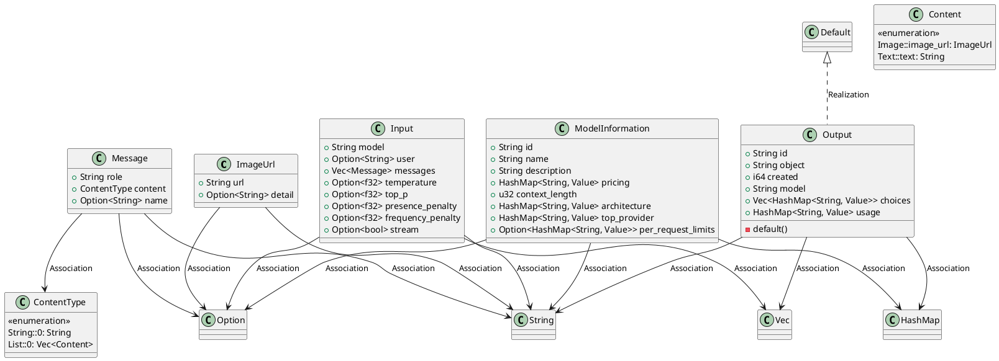
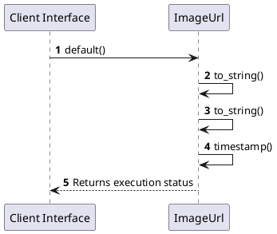

# Module Specification: Dtos

* **Source Reference:** `src/application/dtos.rs`
* **Package Dependency:**
- `use serde::{Deserialize, Serialize};`
- `use serde_json::Value;`
- `use std::collections::HashMap;`

## 1. Executive Summary & Purpose
Deterministic technical architecture for the `Dtos` module extracted directly from the codebase.

## 2. UML 2.0 Diagrams
### Class & Inheritance Architecture

### Execution Flow & Runtime Behavior

## 3. Data Structures, Structs & Class Properties

### ImageUrl
| Property | Type | Description |
| :--- | :--- | :--- |
| `url` | `String` | Field of ImageUrl |
| `detail` | `Option<String>` | Field of ImageUrl |

### Content
| Property | Type | Description |
| :--- | :--- | :--- |
| `Image::image_url` | `ImageUrl` | Field of Content |
| `Text::text` | `String` | Field of Content |

### ModelInformation
| Property | Type | Description |
| :--- | :--- | :--- |
| `id` | `String` | Field of ModelInformation |
| `name` | `String` | Field of ModelInformation |
| `description` | `String` | Field of ModelInformation |
| `pricing` | `HashMap<String, Value>` | Field of ModelInformation |
| `context_length` | `u32` | Field of ModelInformation |
| `architecture` | `HashMap<String, Value>` | Field of ModelInformation |
| `top_provider` | `HashMap<String, Value>` | Field of ModelInformation |
| `per_request_limits` | `Option<HashMap<String, Value>>` | Field of ModelInformation |

### Message
| Property | Type | Description |
| :--- | :--- | :--- |
| `role` | `String` | Field of Message |
| `content` | `ContentType` | Field of Message |
| `name` | `Option<String>` | Field of Message |

### ContentType
| Property | Type | Description |
| :--- | :--- | :--- |
| `String::0` | `String` | Field of ContentType |
| `List::0` | `Vec<Content>` | Field of ContentType |

### Input
| Property | Type | Description |
| :--- | :--- | :--- |
| `model` | `String` | Field of Input |
| `user` | `Option<String>` | Field of Input |
| `messages` | `Vec<Message>` | Field of Input |
| `temperature` | `Option<f32>` | Field of Input |
| `top_p` | `Option<f32>` | Field of Input |
| `presence_penalty` | `Option<f32>` | Field of Input |
| `frequency_penalty` | `Option<f32>` | Field of Input |
| `stream` | `Option<bool>` | Field of Input |

### Output
| Property | Type | Description |
| :--- | :--- | :--- |
| `id` | `String` | Field of Output |
| `object` | `String` | Field of Output |
| `created` | `i64` | Field of Output |
| `model` | `String` | Field of Output |
| `choices` | `Vec<HashMap<String, Value>>` | Field of Output |
| `usage` | `HashMap<String, Value>` | Field of Output |

## 4. Comprehensive Methods & Functions Breakdown

### `Output::default`
* **Visibility:** -
* **Source Line Citation:** `src/application/dtos.rs:L71`

#### Input Parameters
| Parameter | Data Type | Required / Default | Semantic Description |
| :--- | :--- | :--- | :--- |
| None | None | N/A | No parameters |

#### Return Value & Output Shape
| Return Type | Scenario | Description |
| :--- | :--- | :--- |
| `Self` | Success | Result of the operation |

## 5. Source Code Citations & Index
* Class `ImageUrl`: `src/application/dtos.rs:L6`
* Class `Content`: `src/application/dtos.rs:L13`
* Class `ModelInformation`: `src/application/dtos.rs:L22`
* Class `Message`: `src/application/dtos.rs:L34`
* Class `ContentType`: `src/application/dtos.rs:L42`
* Class `Input`: `src/application/dtos.rs:L48`
* Class `Output`: `src/application/dtos.rs:L61`
* Method `default` in `Output`: `src/application/dtos.rs:L71`
