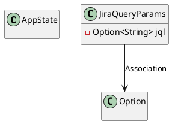
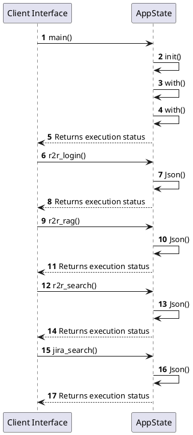

# Module Specification: Mock_services

* **Source Reference:** `src/bin/mock_services.rs`
* **Package Dependency:**
- `use axum::{
    extract::Query,
    routing::{get, post},
    Json, Router,
};`
- `use serde::Deserialize;`
- `use serde_json::{json, Value};`
- `use std::net::SocketAddr;`
- `use std::sync::Arc;`
- `use tracing_subscriber::{layer::SubscriberExt, util::SubscriberInitExt};`

## 1. Executive Summary & Purpose
Deterministic technical architecture for the `Mock_services` module extracted directly from the codebase.

## 2. UML 2.0 Diagrams
### Class & Inheritance Architecture

### Execution Flow & Runtime Behavior

## 3. Data Structures, Structs & Class Properties

### JiraQueryParams
| Property | Type | Description |
| :--- | :--- | :--- |
| `jql` | `Option<String>` | Field of JiraQueryParams |

## 4. Comprehensive Methods & Functions Breakdown

### `main`
* **Visibility:** -
* **Source Line Citation:** `src/bin/mock_services.rs:L16`

#### Input Parameters
| Parameter | Data Type | Required / Default | Semantic Description |
| :--- | :--- | :--- | :--- |
| None | None | N/A | No parameters |

#### Return Value & Output Shape
| Return Type | Scenario | Description |
| :--- | :--- | :--- |
| `()` | Success | Result of the operation |

### `r2r_login`
* **Visibility:** -
* **Source Line Citation:** `src/bin/mock_services.rs:L40`

#### Input Parameters
| Parameter | Data Type | Required / Default | Semantic Description |
| :--- | :--- | :--- | :--- |
| None | None | N/A | No parameters |

#### Return Value & Output Shape
| Return Type | Scenario | Description |
| :--- | :--- | :--- |
| `Json<Value>` | Success | Result of the operation |

### `r2r_rag`
* **Visibility:** -
* **Source Line Citation:** `src/bin/mock_services.rs:L51`

#### Input Parameters
| Parameter | Data Type | Required / Default | Semantic Description |
| :--- | :--- | :--- | :--- |
| `Json(payload)` | `Json<Value>` | Required | Parameter |

#### Return Value & Output Shape
| Return Type | Scenario | Description |
| :--- | :--- | :--- |
| `Json<Value>` | Success | Result of the operation |

### `r2r_search`
* **Visibility:** -
* **Source Line Citation:** `src/bin/mock_services.rs:L60`

#### Input Parameters
| Parameter | Data Type | Required / Default | Semantic Description |
| :--- | :--- | :--- | :--- |
| `Json(payload)` | `Json<Value>` | Required | Parameter |

#### Return Value & Output Shape
| Return Type | Scenario | Description |
| :--- | :--- | :--- |
| `Json<Value>` | Success | Result of the operation |

### `jira_search`
* **Visibility:** -
* **Source Line Citation:** `src/bin/mock_services.rs:L81`

#### Input Parameters
| Parameter | Data Type | Required / Default | Semantic Description |
| :--- | :--- | :--- | :--- |
| `Query(params)` | `Query<JiraQueryParams>` | Required | Parameter |

#### Return Value & Output Shape
| Return Type | Scenario | Description |
| :--- | :--- | :--- |
| `Json<Value>` | Success | Result of the operation |

## 5. Source Code Citations & Index
* Class `AppState`: `src/bin/mock_services.rs:L13`
* Class `JiraQueryParams`: `src/bin/mock_services.rs:L77`
* Method `main`: `src/bin/mock_services.rs:L16`
* Method `r2r_login`: `src/bin/mock_services.rs:L40`
* Method `r2r_rag`: `src/bin/mock_services.rs:L51`
* Method `r2r_search`: `src/bin/mock_services.rs:L60`
* Method `jira_search`: `src/bin/mock_services.rs:L81`
