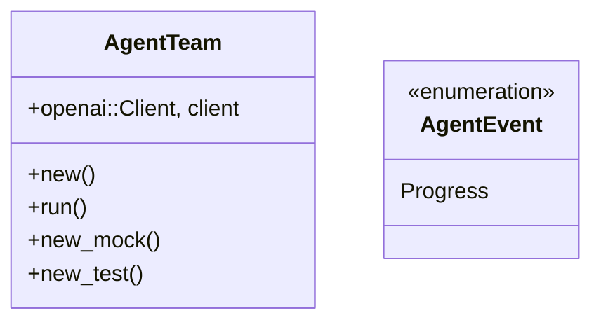
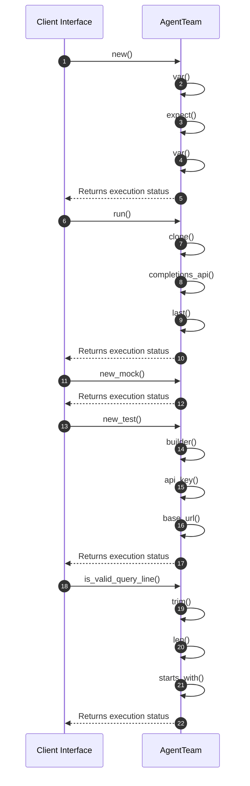

# Module Specification: Team

* **Source Reference:** `src/domain/agent/team.rs`
* **Package Dependency:**
- `async_stream::stream`
- `crate::application::dtos::Input`
- `crate::infrastructure::tools::confluence::ConfluenceTool`
- `crate::infrastructure::tools::jira::JiraTool`
- `crate::infrastructure::tools::r2r::R2RTool`
- `futures::{future::join_all, Stream, StreamExt}`
- `rig::agent::MultiTurnStreamItem`
- `rig::client::CompletionClient`
- `rig::completion::Prompt`
- `rig::providers::openai`
- `rig::streaming::{StreamedAssistantContent, StreamingPrompt}`
- `serde_json`
- `std::env`
- `std::pin::Pin`

## 1. Executive Summary & Purpose
Deterministic technical architecture for the `Team` module extracted directly from the codebase.

## 2. UML 2.0 Diagrams
### Class & Inheritance Architecture

### Execution Flow & Runtime Behavior

## 3. Data Structures, Structs & Class Properties

### AgentTeam
| Property | Type | Description |
| :--- | :--- | :--- |
| `client` | `openai::Client,` | Field of AgentTeam |

### AgentEvent
| Property | Type | Description |
| :--- | :--- | :--- |
| `Progress` | `variant` | Field of AgentEvent |

## 4. Comprehensive Methods & Functions Breakdown

### `AgentTeam::new`
* **Visibility:** +
* **Source Line Citation:** `src/domain/agent/team.rs:L55`

#### Input Parameters
| Parameter | Data Type | Required / Default | Semantic Description |
| :--- | :--- | :--- | :--- |
| None | None | N/A | No parameters |

#### Return Value & Output Shape
| Return Type | Scenario | Description |
| :--- | :--- | :--- |
| `anyhow::Result<Self>` | Success | Result of the operation |

### `AgentTeam::run`
* **Visibility:** +
* **Source Line Citation:** `src/domain/agent/team.rs:L66`

#### Input Parameters
| Parameter | Data Type | Required / Default | Semantic Description |
| :--- | :--- | :--- | :--- |
| `&self` | `self` | Required | Instance reference |
| `input` | `Input` | Required | Parameter |

#### Return Value & Output Shape
| Return Type | Scenario | Description |
| :--- | :--- | :--- |
| `anyhow::Result<String>` | Success | Result of the operation |

### `AgentTeam::new_mock`
* **Visibility:** +
* **Source Line Citation:** `src/domain/agent/team.rs:L454`

#### Input Parameters
| Parameter | Data Type | Required / Default | Semantic Description |
| :--- | :--- | :--- | :--- |
| None | None | N/A | No parameters |

#### Return Value & Output Shape
| Return Type | Scenario | Description |
| :--- | :--- | :--- |
| `Self` | Success | Result of the operation |

### `AgentTeam::new_test`
* **Visibility:** +
* **Source Line Citation:** `src/domain/agent/team.rs:L463`

#### Input Parameters
| Parameter | Data Type | Required / Default | Semantic Description |
| :--- | :--- | :--- | :--- |
| `base_url` | `&str` | Required | Parameter |

#### Return Value & Output Shape
| Return Type | Scenario | Description |
| :--- | :--- | :--- |
| `Self` | Success | Result of the operation |

### `is_valid_query_line`
* **Visibility:** +
* **Source Line Citation:** `src/domain/agent/team.rs:L32`

#### Input Parameters
| Parameter | Data Type | Required / Default | Semantic Description |
| :--- | :--- | :--- | :--- |
| `line` | `&str` | Required | Parameter |

#### Return Value & Output Shape
| Return Type | Scenario | Description |
| :--- | :--- | :--- |
| `bool` | Success | Result of the operation |

## 5. Source Code Citations & Index
* Class `AgentTeam`: `src/domain/agent/team.rs:L51`
* Class `AgentEvent`: `src/domain/agent/team.rs:L23`
* Method `new` in `AgentTeam`: `src/domain/agent/team.rs:L55`
* Method `run` in `AgentTeam`: `src/domain/agent/team.rs:L66`
* Method `new_mock` in `AgentTeam`: `src/domain/agent/team.rs:L454`
* Method `new_test` in `AgentTeam`: `src/domain/agent/team.rs:L463`
* Method `is_valid_query_line`: `src/domain/agent/team.rs:L32`
