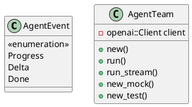
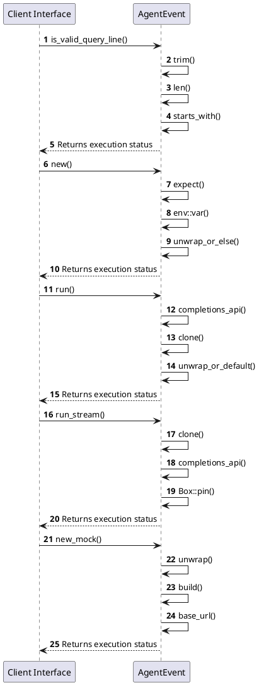

# Module Specification: Team

* **Source Reference:** `src/domain/agent/team.rs`
* **Package Dependency:**
- `use async_stream::stream;`
- `use crate::application::dtos::Input;`
- `use crate::infrastructure::tools::confluence::ConfluenceTool;`
- `use crate::infrastructure::tools::jira::JiraTool;`
- `use crate::infrastructure::tools::r2r::R2RTool;`
- `use futures::{future::join_all, Stream, StreamExt};`
- `use rig::agent::MultiTurnStreamItem;`
- `use rig::client::CompletionClient;`
- `use rig::completion::Prompt;`
- `use rig::providers::openai;`
- `use rig::streaming::{StreamedAssistantContent, StreamingPrompt};`
- `use serde_json;`
- `use std::env;`
- `use std::pin::Pin;`

## 1. Executive Summary & Purpose
Deterministic technical architecture for the `Team` module extracted directly from the codebase.

## 2. UML 2.0 Diagrams
### Class & Inheritance Architecture

### Execution Flow & Runtime Behavior

## 3. Data Structures, Structs & Class Properties

### AgentEvent
**Overview:** Events emitted by the agent pipeline during SSE streaming.

`Progress` events are emitted after the planner and each RAG search.
`Delta` events carry individual QA token chunks.
`Done` signals end-of-stream.
Progress events are **only** produced on the streaming path (`run_stream`).

| Property | Type | Description |
| :--- | :--- | :--- |
| `Progress` | `variant(stage: String, message: String)` | Field of AgentEvent |
| `Delta` | `variant(String)` | Field of AgentEvent |
| `Done` | `variant` | Field of AgentEvent |

### AgentTeam
| Property | Type | Description |
| :--- | :--- | :--- |
| `client` | `openai::Client` | Field of AgentTeam |

## 4. Comprehensive Methods & Functions Breakdown

### `is_valid_query_line`
* **Visibility:** -
* **Source Line Citation:** `src/domain/agent/team.rs:L32`

**Description:** Returns `true` when a planner output line is a valid standalone search query.
Rejects: empty lines, JSON structural tokens, quoted strings, the literal
TERMINATE keyword, and lines that are too short to be meaningful queries.

#### Input Parameters
| Parameter | Data Type | Required / Default | Semantic Description |
| :--- | :--- | :--- | :--- |
| `line` | `&str` | Required | Parameter |

#### Return Value & Output Shape
| Return Type | Scenario | Description |
| :--- | :--- | :--- |
| `bool` | Success | Result of the operation |

### `AgentTeam::new`
* **Visibility:** +
* **Source Line Citation:** `src/domain/agent/team.rs:L56`

#### Input Parameters
| Parameter | Data Type | Required / Default | Semantic Description |
| :--- | :--- | :--- | :--- |
| None | None | N/A | No parameters |

#### Return Value & Output Shape
| Return Type | Scenario | Description |
| :--- | :--- | :--- |
| `anyhow::Result<Self>` | Success | Result of the operation |

### `AgentTeam::run`
* **Visibility:** +
* **Source Line Citation:** `src/domain/agent/team.rs:L69`

#### Input Parameters
| Parameter | Data Type | Required / Default | Semantic Description |
| :--- | :--- | :--- | :--- |
| `&self` | `self` | Required | Instance reference |
| `input` | `Input` | Required | Parameter |

#### Return Value & Output Shape
| Return Type | Scenario | Description |
| :--- | :--- | :--- |
| `anyhow::Result<String>` | Success | Result of the operation |

### `AgentTeam::run_stream`
* **Visibility:** +
* **Source Line Citation:** `src/domain/agent/team.rs:L245`

**Description:** Run the agent pipeline with full SSE progress streaming.

Emits:
- `AgentEvent::Progress` after the planner stage and after each RAG search.
- `AgentEvent::Delta` for each streaming token from the QA agent.
- `AgentEvent::Done` once all tokens have been emitted.

Progress events are **not** produced by the non-streaming `run()` method.

#### Input Parameters
| Parameter | Data Type | Required / Default | Semantic Description |
| :--- | :--- | :--- | :--- |
| `&self` | `self` | Required | Instance reference |
| `input` | `Input` | Required | Parameter |

#### Return Value & Output Shape
| Return Type | Scenario | Description |
| :--- | :--- | :--- |
| `anyhow::Result<Pin<Box<dyn Stream<Item = anyhow::Result<AgentEvent>> + Send>>>` | Success | Result of the operation |

### `AgentTeam::new_mock`
* **Visibility:** +
* **Source Line Citation:** `src/domain/agent/team.rs:L457`

#### Input Parameters
| Parameter | Data Type | Required / Default | Semantic Description |
| :--- | :--- | :--- | :--- |
| None | None | N/A | No parameters |

#### Return Value & Output Shape
| Return Type | Scenario | Description |
| :--- | :--- | :--- |
| `Self` | Success | Result of the operation |

### `AgentTeam::new_test`
* **Visibility:** +
* **Source Line Citation:** `src/domain/agent/team.rs:L466`

#### Input Parameters
| Parameter | Data Type | Required / Default | Semantic Description |
| :--- | :--- | :--- | :--- |
| `base_url` | `&str` | Required | Parameter |

#### Return Value & Output Shape
| Return Type | Scenario | Description |
| :--- | :--- | :--- |
| `Self` | Success | Result of the operation |

## 5. Source Code Citations & Index
* Class `AgentEvent`: `src/domain/agent/team.rs:L23`
* Class `AgentTeam`: `src/domain/agent/team.rs:L51`
* Method `is_valid_query_line`: `src/domain/agent/team.rs:L32`
* Method `new` in `AgentTeam`: `src/domain/agent/team.rs:L56`
* Method `run` in `AgentTeam`: `src/domain/agent/team.rs:L69`
* Method `run_stream` in `AgentTeam`: `src/domain/agent/team.rs:L245`
* Method `new_mock` in `AgentTeam`: `src/domain/agent/team.rs:L457`
* Method `new_test` in `AgentTeam`: `src/domain/agent/team.rs:L466`
