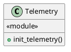
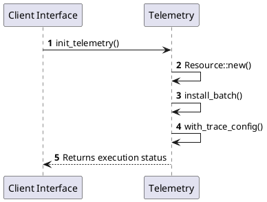

# Module Specification: Telemetry

* **Source Reference:** `src/infrastructure/telemetry.rs`
* **Package Dependency:**
- `use opentelemetry::KeyValue;`
- `use opentelemetry_otlp::WithExportConfig;`
- `use opentelemetry_sdk::{runtime, trace::Config, Resource};`
- `use tracing_subscriber::{layer::SubscriberExt, util::SubscriberInitExt, EnvFilter};`

## 1. Executive Summary & Purpose
Deterministic technical architecture for the `Telemetry` module extracted directly from the codebase.

## 2. UML 2.0 Diagrams
### Class & Inheritance Architecture

### Execution Flow & Runtime Behavior

## 3. Data Structures, Structs & Class Properties

No notable data structures or fields in this module.

## 4. Comprehensive Methods & Functions Breakdown

### `init_telemetry`
* **Visibility:** +
* **Source Line Citation:** `src/infrastructure/telemetry.rs:L6`

#### Input Parameters
| Parameter | Data Type | Required / Default | Semantic Description |
| :--- | :--- | :--- | :--- |
| `app_name` | `&str` | Required | Parameter |
| `endpoint` | `&str` | Required | Parameter |

#### Return Value & Output Shape
| Return Type | Scenario | Description |
| :--- | :--- | :--- |
| `anyhow::Result<()>` | Success | Result of the operation |

## 5. Source Code Citations & Index
* Class `Telemetry`: `src/infrastructure/telemetry.rs:L1`
* Method `init_telemetry`: `src/infrastructure/telemetry.rs:L6`
