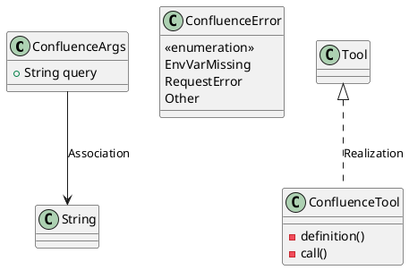
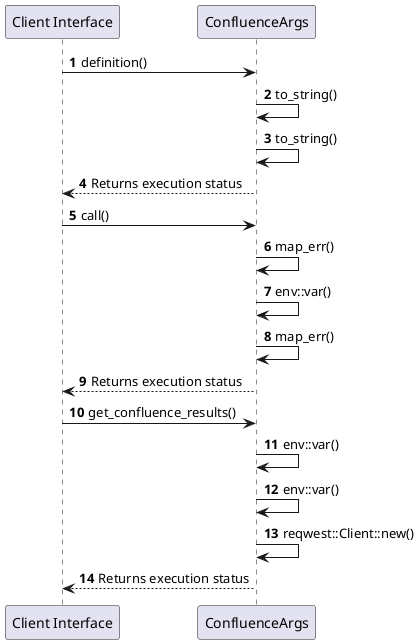

# Module Specification: Confluence

* **Source Reference:** `src/infrastructure/tools/confluence.rs`
* **Package Dependency:**
- `use rig::completion::ToolDefinition;`
- `use rig::tool::Tool;`
- `use serde::Deserialize;`
- `use serde_json::json;`
- `use std::env;`
- `use thiserror::Error;`

## 1. Executive Summary & Purpose
Deterministic technical architecture for the `Confluence` module extracted directly from the codebase.

## 2. UML 2.0 Diagrams
### Class & Inheritance Architecture

### Execution Flow & Runtime Behavior

## 3. Data Structures, Structs & Class Properties

### ConfluenceArgs
| Property | Type | Description |
| :--- | :--- | :--- |
| `query` | `String` | Field of ConfluenceArgs |

### ConfluenceError
| Property | Type | Description |
| :--- | :--- | :--- |
| `EnvVarMissing` | `variant(#[from], env::VarError)` | Field of ConfluenceError |
| `RequestError` | `variant(#[from], reqwest::Error)` | Field of ConfluenceError |
| `Other` | `variant(String)` | Field of ConfluenceError |

### ConfluenceTool

## 4. Comprehensive Methods & Functions Breakdown

### `ConfluenceTool::definition`
* **Visibility:** -
* **Source Line Citation:** `src/infrastructure/tools/confluence.rs:L31`

#### Input Parameters
| Parameter | Data Type | Required / Default | Semantic Description |
| :--- | :--- | :--- | :--- |
| `&self` | `self` | Required | Instance reference |
| `_prompt` | `String` | Required | Parameter |

#### Return Value & Output Shape
| Return Type | Scenario | Description |
| :--- | :--- | :--- |
| `ToolDefinition` | Success | Result of the operation |

### `ConfluenceTool::call`
* **Visibility:** -
* **Source Line Citation:** `src/infrastructure/tools/confluence.rs:L48`

#### Input Parameters
| Parameter | Data Type | Required / Default | Semantic Description |
| :--- | :--- | :--- | :--- |
| `&self` | `self` | Required | Instance reference |
| `args: Self::Args` | `self` | Required | Instance reference |

#### Return Value & Output Shape
| Return Type | Scenario | Description |
| :--- | :--- | :--- |
| `Result<Self::Output, Self::Error>` | Success | Result of the operation |

### `get_confluence_results`
* **Visibility:** +
* **Source Line Citation:** `src/infrastructure/tools/confluence.rs:L56`

#### Input Parameters
| Parameter | Data Type | Required / Default | Semantic Description |
| :--- | :--- | :--- | :--- |
| `url` | `&str` | Required | Parameter |
| `query` | `&str` | Required | Parameter |

#### Return Value & Output Shape
| Return Type | Scenario | Description |
| :--- | :--- | :--- |
| `anyhow::Result<String>` | Success | Result of the operation |

## 5. Source Code Citations & Index
* Class `ConfluenceArgs`: `src/infrastructure/tools/confluence.rs:L9`
* Class `ConfluenceError`: `src/infrastructure/tools/confluence.rs:L14`
* Class `ConfluenceTool`: `src/infrastructure/tools/confluence.rs:L23`
* Method `definition` in `ConfluenceTool`: `src/infrastructure/tools/confluence.rs:L31`
* Method `call` in `ConfluenceTool`: `src/infrastructure/tools/confluence.rs:L48`
* Method `get_confluence_results`: `src/infrastructure/tools/confluence.rs:L56`
