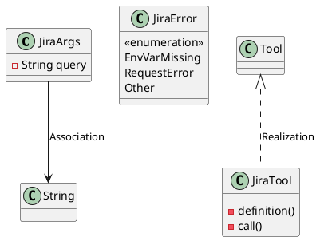
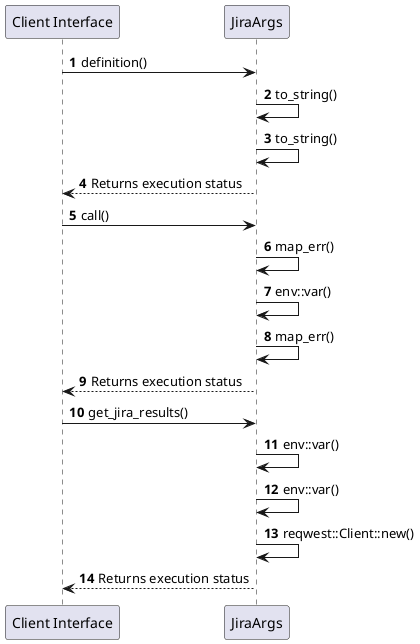

# Module Specification: Jira

* **Source Reference:** `src/infrastructure/tools/jira.rs`
* **Package Dependency:**
- `use rig::completion::ToolDefinition;`
- `use rig::tool::Tool;`
- `use serde::Deserialize;`
- `use serde_json::json;`
- `use std::env;`
- `use thiserror::Error;`

## 1. Executive Summary & Purpose
Deterministic technical architecture for the `Jira` module extracted directly from the codebase.

## 2. UML 2.0 Diagrams
### Class & Inheritance Architecture

### Execution Flow & Runtime Behavior

## 3. Data Structures, Structs & Class Properties

### JiraArgs
| Property | Type | Description |
| :--- | :--- | :--- |
| `query` | `String` | Field of JiraArgs |

### JiraError
| Property | Type | Description |
| :--- | :--- | :--- |
| `EnvVarMissing` | `variant` | Field of JiraError |
| `RequestError` | `variant` | Field of JiraError |
| `Other` | `variant` | Field of JiraError |

## 4. Comprehensive Methods & Functions Breakdown

### `JiraTool::definition`
* **Visibility:** -
* **Source Line Citation:** `src/infrastructure/tools/jira.rs:L31`

#### Input Parameters
| Parameter | Data Type | Required / Default | Semantic Description |
| :--- | :--- | :--- | :--- |
| `&self` | `self` | Required | Instance reference |
| `_prompt` | `String` | Required | Parameter |

#### Return Value & Output Shape
| Return Type | Scenario | Description |
| :--- | :--- | :--- |
| `ToolDefinition` | Success | Result of the operation |

### `JiraTool::call`
* **Visibility:** -
* **Source Line Citation:** `src/infrastructure/tools/jira.rs:L48`

#### Input Parameters
| Parameter | Data Type | Required / Default | Semantic Description |
| :--- | :--- | :--- | :--- |
| `&self` | `self` | Required | Instance reference |
| `args: Self::Args` | `self` | Required | Instance reference |

#### Return Value & Output Shape
| Return Type | Scenario | Description |
| :--- | :--- | :--- |
| `Result<Self::Output, Self::Error>` | Success | Result of the operation |

### `get_jira_results`
* **Visibility:** -
* **Source Line Citation:** `src/infrastructure/tools/jira.rs:L56`

#### Input Parameters
| Parameter | Data Type | Required / Default | Semantic Description |
| :--- | :--- | :--- | :--- |
| `url` | `&str` | Required | Parameter |
| `query` | `&str` | Required | Parameter |

#### Return Value & Output Shape
| Return Type | Scenario | Description |
| :--- | :--- | :--- |
| `anyhow::Result<String>` | Success | Result of the operation |

## 5. Source Code Citations & Index
* Class `JiraArgs`: `src/infrastructure/tools/jira.rs:L9`
* Class `JiraError`: `src/infrastructure/tools/jira.rs:L14`
* Class `JiraTool`: `src/infrastructure/tools/jira.rs:L23`
* Method `definition` in `JiraTool`: `src/infrastructure/tools/jira.rs:L31`
* Method `call` in `JiraTool`: `src/infrastructure/tools/jira.rs:L48`
* Method `get_jira_results`: `src/infrastructure/tools/jira.rs:L56`
