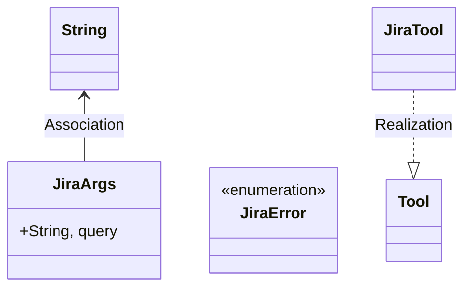
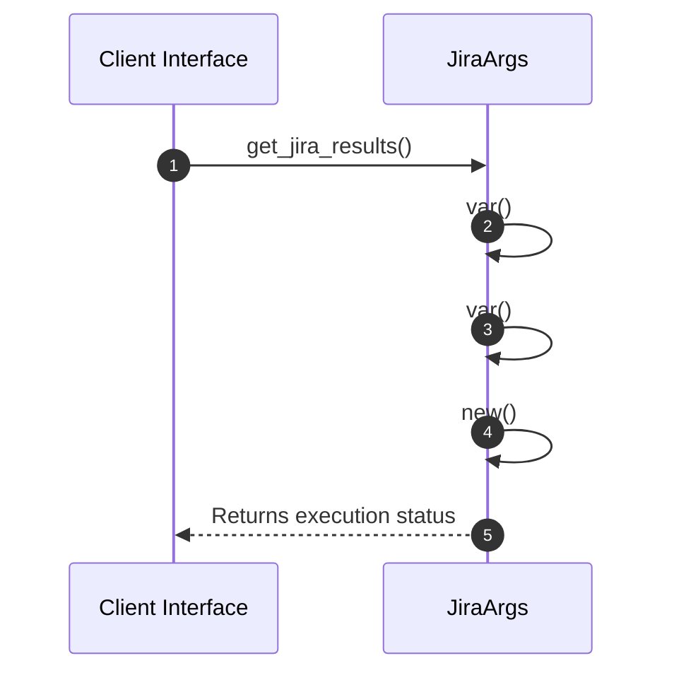

# Module Specification: Jira

* **Source Reference:** `src/infrastructure/tools/jira.rs`
* **Package Dependency:**
- `rig::completion::ToolDefinition`
- `rig::tool::Tool`
- `serde::Deserialize`
- `serde_json::json`
- `std::env`
- `thiserror::Error`

## 1. Executive Summary & Purpose
Deterministic technical architecture for the `Jira` module extracted directly from the codebase.

## 2. UML 2.0 Diagrams
### Class & Inheritance Architecture

### Execution Flow & Runtime Behavior

## 3. Data Structures, Structs & Class Properties

### JiraArgs
| Property | Type | Description |
| :--- | :--- | :--- |
| `query` | `String,` | Field of JiraArgs |

## 4. Comprehensive Methods & Functions Breakdown

### `get_jira_results`
* **Visibility:** +
* **Source Line Citation:** `src/infrastructure/tools/jira.rs:L56`

#### Input Parameters
| Parameter | Data Type | Required / Default | Semantic Description |
| :--- | :--- | :--- | :--- |
| `url` | `&str` | Required | Parameter |
| `query` | `&str` | Required | Parameter |

#### Return Value & Output Shape
| Return Type | Scenario | Description |
| :--- | :--- | :--- |
| `anyhow::Result<String>` | Success | Result of the operation |

## 5. Source Code Citations & Index
* Class `JiraArgs`: `src/infrastructure/tools/jira.rs:L9`
* Class `JiraError`: `src/infrastructure/tools/jira.rs:L14`
* Method `get_jira_results`: `src/infrastructure/tools/jira.rs:L56`
