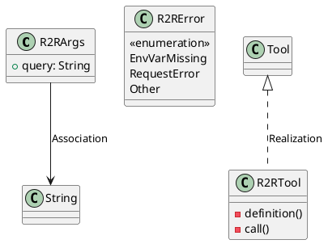
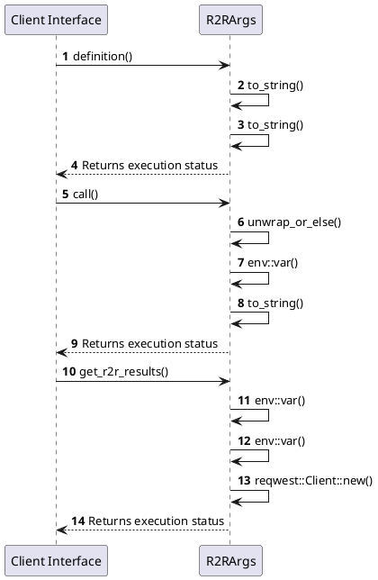

# Module Specification: R2r

* **Source Reference:** `src/infrastructure/tools/r2r.rs`
* **Package Dependency:**
- `use rig::completion::ToolDefinition;`
- `use rig::tool::Tool;`
- `use serde::Deserialize;`
- `use serde_json::json;`
- `use std::env;`
- `use thiserror::Error;`

## 1. Executive Summary & Purpose
Deterministic technical architecture for the `R2r` module extracted directly from the codebase.

## 2. UML 2.0 Diagrams
### Class & Inheritance Architecture

```plantuml
@startuml
    class R2RArgs {
        +query: String
    }
    class R2RError {
        <<enumeration>>
        EnvVarMissing
        RequestError
        Other
    }
    class R2RTool {
        -definition()
        -call()
    }
    R2RArgs --> "String" : Association
    Tool <|.. R2RTool : Realization
@enduml
```


### Execution Flow & Runtime Behavior

```plantuml
@startuml
    autonumber
    participant "Client Interface" as Caller
    participant R2RArgs as Svc
    Caller->Svc: definition()
    Svc->Svc: to_string()
    Svc->Svc: to_string()
    Svc-->Caller: Returns execution status
    Caller->Svc: call()
    Svc->Svc: unwrap_or_else()
    Svc->Svc: env::var()
    Svc->Svc: to_string()
    Svc-->Caller: Returns execution status
    Caller->Svc: get_r2r_results()
    Svc->Svc: env::var()
    Svc->Svc: env::var()
    Svc->Svc: reqwest::Client::new()
    Svc-->Caller: Returns execution status
@enduml
```


## 3. Data Structures, Structs & Class Properties

### R2RArgs
| Property | Type | Description |
| :--- | :--- | :--- |
| `query` | `String` | Field of R2RArgs |

### R2RError
| Property | Type | Description |
| :--- | :--- | :--- |
| `EnvVarMissing` | `variant(#[from], env::VarError)` | Field of R2RError |
| `RequestError` | `variant(#[from], reqwest::Error)` | Field of R2RError |
| `Other` | `variant(String)` | Field of R2RError |

### R2RTool


## 4. Comprehensive Methods & Functions Breakdown

### `R2RTool::definition`
* **Visibility:** -
* **Source Line Citation:** `src/infrastructure/tools/r2r.rs:L31`

**Purpose:** No description provided.

#### Parameters
| Parameter | Type | Description |
| :--- | :--- | :--- |
| `&self` | `self` | Instance reference |
| `_prompt` | `String` | Parameter |

#### Return value
`ToolDefinition`

### `R2RTool::call`
* **Visibility:** -
* **Source Line Citation:** `src/infrastructure/tools/r2r.rs:L49`

**Purpose:** No description provided.

#### Parameters
| Parameter | Type | Description |
| :--- | :--- | :--- |
| `&self` | `self` | Instance reference |
| `args` | `Self` | Parameter |

#### Return value
`Result<Self::Output, Self::Error>`

### `get_r2r_results`
* **Visibility:** +
* **Source Line Citation:** `src/infrastructure/tools/r2r.rs:L57`

**Description:** No description provided.

#### Inputs
| Parameter | Data Type | Required / Default | Semantic Description |
| :--- | :--- | :--- | :--- |
| `url` | `&str` | Required | Parameter |
| `query` | `&str` | Required | Parameter |

#### Output
| Return Type | Scenario | Description |
| :--- | :--- | :--- |
| `anyhow::Result<String>` | Success | Result of the operation |

#### Side Effects
None identified.

#### Complexity
- **Time Complexity:** O(1) (Estimated)
- **Space Complexity:** O(1) (Estimated)

#### Example
```rust
// Example usage
```


## 5. Source Code Citations & Index
* Class `R2RArgs`: `src/infrastructure/tools/r2r.rs:L9`
* Class `R2RError`: `src/infrastructure/tools/r2r.rs:L14`
* Class `R2RTool`: `src/infrastructure/tools/r2r.rs:L23`
* Method `definition` in `R2RTool`: `src/infrastructure/tools/r2r.rs:L31`
* Method `call` in `R2RTool`: `src/infrastructure/tools/r2r.rs:L49`
* Method `get_r2r_results`: `src/infrastructure/tools/r2r.rs:L57`
