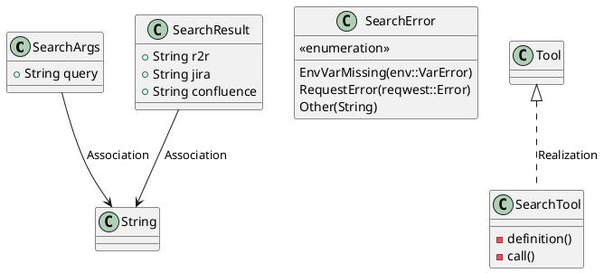
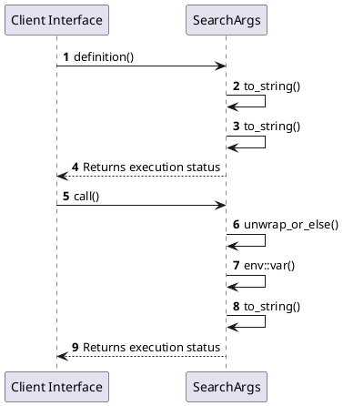

# Module Specification: Search

* **Source Reference:** `src/infrastructure/tools/search.rs`
* **Package Dependency:**
- `use crate::infrastructure::tools::confluence::get_confluence_results;`
- `use crate::infrastructure::tools::jira::get_jira_results;`
- `use crate::infrastructure::tools::r2r::get_r2r_results;`
- `use rig::completion::ToolDefinition;`
- `use rig::tool::Tool;`
- `use serde::{Deserialize, Serialize};`
- `use serde_json::json;`
- `use std::env;`
- `use thiserror::Error;`

## 1. Executive Summary & Purpose
Deterministic technical architecture for the `Search` module extracted directly from the codebase.

## 2. UML 2.0 Diagrams
### Class & Inheritance Architecture

### Execution Flow & Runtime Behavior

## 3. Data Structures, Structs & Class Properties

### SearchArgs
| Property | Type | Description |
| :--- | :--- | :--- |
| `query` | `String` | Field of SearchArgs |

### SearchResult
| Property | Type | Description |
| :--- | :--- | :--- |
| `r2r` | `String` | Field of SearchResult |
| `jira` | `String` | Field of SearchResult |
| `confluence` | `String` | Field of SearchResult |

### SearchError
| Property | Type | Description |
| :--- | :--- | :--- |
| `EnvVarMissing` | `tuple(env::VarError)` | Field of SearchError |
| `RequestError` | `tuple(reqwest::Error)` | Field of SearchError |
| `Other` | `tuple(String)` | Field of SearchError |

## 4. Comprehensive Methods & Functions Breakdown

### `SearchTool::definition`
* **Visibility:** -
* **Source Line Citation:** `src/infrastructure/tools/search.rs:L41`

#### Input Parameters
| Parameter | Data Type | Required / Default | Semantic Description |
| :--- | :--- | :--- | :--- |
| `&self` | `self` | Required | Instance reference |
| `_prompt` | `String` | Required | Parameter |

#### Return Value & Output Shape
| Return Type | Scenario | Description |
| :--- | :--- | :--- |
| `ToolDefinition` | Success | Result of the operation |

### `SearchTool::call`
* **Visibility:** -
* **Source Line Citation:** `src/infrastructure/tools/search.rs:L58`

#### Input Parameters
| Parameter | Data Type | Required / Default | Semantic Description |
| :--- | :--- | :--- | :--- |
| `&self` | `self` | Required | Instance reference |
| `args: Self::Args` | `self` | Required | Instance reference |

#### Return Value & Output Shape
| Return Type | Scenario | Description |
| :--- | :--- | :--- |
| `Result<Self::Output, Self::Error>` | Success | Result of the operation |

## 5. Source Code Citations & Index
* Class `SearchArgs`: `src/infrastructure/tools/search.rs:L12`
* Class `SearchResult`: `src/infrastructure/tools/search.rs:L17`
* Class `SearchError`: `src/infrastructure/tools/search.rs:L24`
* Class `SearchTool`: `src/infrastructure/tools/search.rs:L33`
* Method `definition` in `SearchTool`: `src/infrastructure/tools/search.rs:L41`
* Method `call` in `SearchTool`: `src/infrastructure/tools/search.rs:L58`
