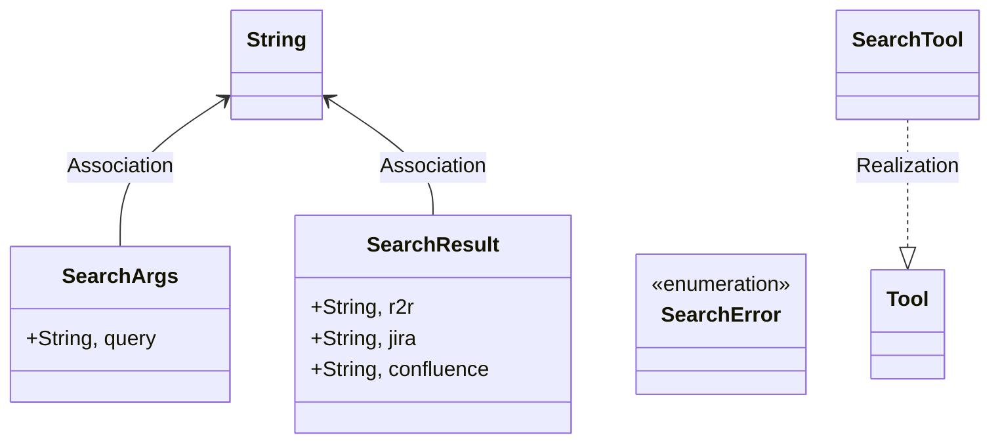
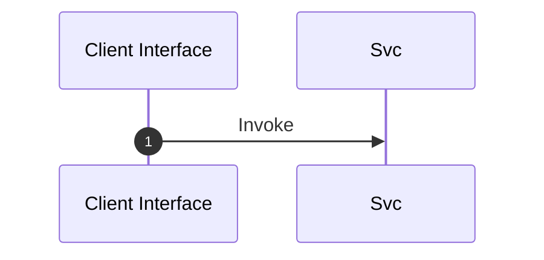

# Module Specification: Search

* **Source Reference:** `src/infrastructure/tools/search.rs`
* **Package Dependency:**
- `crate::infrastructure::tools::confluence::get_confluence_results`
- `crate::infrastructure::tools::jira::get_jira_results`
- `crate::infrastructure::tools::r2r::get_r2r_results`
- `rig::completion::ToolDefinition`
- `rig::tool::Tool`
- `serde::{Deserialize, Serialize}`
- `serde_json::json`
- `std::env`
- `thiserror::Error`

## 1. Executive Summary & Purpose
Deterministic technical architecture for the `Search` module extracted directly from the codebase.

## 2. UML 2.0 Diagrams
### Class & Inheritance Architecture

### Execution Flow & Runtime Behavior

## 3. Data Structures, Structs & Class Properties

### SearchArgs
| Property | Type | Description |
| :--- | :--- | :--- |
| `query` | `String,` | Field of SearchArgs |

### SearchResult
| Property | Type | Description |
| :--- | :--- | :--- |
| `r2r` | `String,` | Field of SearchResult |
| `jira` | `String,` | Field of SearchResult |
| `confluence` | `String,` | Field of SearchResult |

## 4. Comprehensive Methods & Functions Breakdown

No methods or functions defined in this module.

## 5. Source Code Citations & Index
* Class `SearchArgs`: `src/infrastructure/tools/search.rs:L12`
* Class `SearchResult`: `src/infrastructure/tools/search.rs:L17`
* Class `SearchError`: `src/infrastructure/tools/search.rs:L24`
