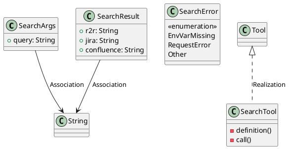
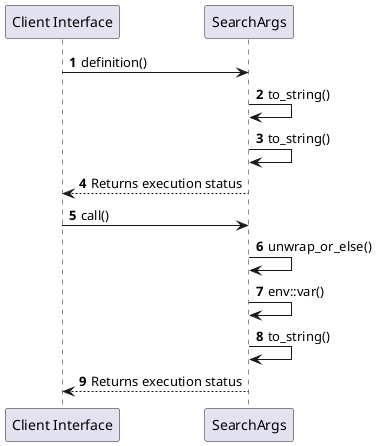

# Module Specification: Search

* **Source Reference:** `src/infrastructure/tools/search.rs`
* **Package Dependency:**
- `use crate::infrastructure::tools::confluence::get_confluence_results;`
- `use crate::infrastructure::tools::jira::get_jira_results;`
- `use crate::infrastructure::tools::r2r::get_r2r_results;`
- `use rig::completion::ToolDefinition;`
- `use rig::tool::Tool;`
- `use serde::{Deserialize, Serialize};`
- `use serde_json::json;`
- `use std::env;`
- `use thiserror::Error;`

## 1. Executive Summary & Purpose
Deterministic technical architecture for the `Search` module extracted directly from the codebase.

## 2. UML 2.0 Diagrams
### Class & Inheritance Architecture

```plantuml
@startuml
    class SearchArgs {
        +query: String
    }
    class SearchResult {
        +r2r: String
        +jira: String
        +confluence: String
    }
    class SearchError {
        <<enumeration>>
        EnvVarMissing
        RequestError
        Other
    }
    class SearchTool {
        -definition()
        -call()
    }
    SearchArgs --> "String" : Association
    SearchResult --> "String" : Association
    Tool <|.. SearchTool : Realization
@enduml
```

### Execution Flow & Runtime Behavior

```plantuml
@startuml
    autonumber
    participant "Client Interface" as Caller
    participant SearchArgs as Svc
    Caller->Svc: definition()
    Svc->Svc: to_string()
    Svc->Svc: to_string()
    Svc-->Caller: Returns execution status
    Caller->Svc: call()
    Svc->Svc: unwrap_or_else()
    Svc->Svc: env::var()
    Svc->Svc: to_string()
    Svc-->Caller: Returns execution status
@enduml
```

## 3. Data Structures, Structs & Class Properties

### SearchArgs
| Property | Type | Description |
| :--- | :--- | :--- |
| `query` | `String` | Field of SearchArgs |

### SearchResult
| Property | Type | Description |
| :--- | :--- | :--- |
| `r2r` | `String` | Field of SearchResult |
| `jira` | `String` | Field of SearchResult |
| `confluence` | `String` | Field of SearchResult |

### SearchError
| Property | Type | Description |
| :--- | :--- | :--- |
| `EnvVarMissing` | `variant(#[from], env::VarError)` | Field of SearchError |
| `RequestError` | `variant(#[from], reqwest::Error)` | Field of SearchError |
| `Other` | `variant(String)` | Field of SearchError |

### SearchTool

## 4. Comprehensive Methods & Functions Breakdown

### `SearchTool::definition`
* **Visibility:** -
* **Source Line Citation:** `src/infrastructure/tools/search.rs:L41`

**Purpose:** No description provided.

#### Parameters
| Parameter | Type | Description |
| :--- | :--- | :--- |
| `&self` | `self` | Instance reference |
| `_prompt` | `String` | Parameter |

#### Return value
`ToolDefinition`

### `SearchTool::call`
* **Visibility:** -
* **Source Line Citation:** `src/infrastructure/tools/search.rs:L58`

**Purpose:** No description provided.

#### Parameters
| Parameter | Type | Description |
| :--- | :--- | :--- |
| `&self` | `self` | Instance reference |
| `args` | `Self` | Parameter |

#### Return value
`Result<Self::Output, Self::Error>`

## 5. Source Code Citations & Index
* Class `SearchArgs`: `src/infrastructure/tools/search.rs:L12`
* Class `SearchResult`: `src/infrastructure/tools/search.rs:L17`
* Class `SearchError`: `src/infrastructure/tools/search.rs:L24`
* Class `SearchTool`: `src/infrastructure/tools/search.rs:L33`
* Method `definition` in `SearchTool`: `src/infrastructure/tools/search.rs:L41`
* Method `call` in `SearchTool`: `src/infrastructure/tools/search.rs:L58`
