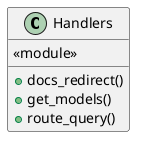
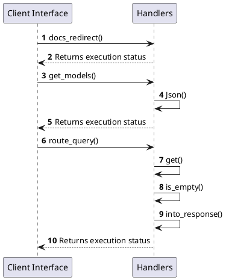

# Module Specification: Handlers

* **Source Reference:** `src/interface/http/handlers.rs`
* **Package Dependency:**
- `use axum::{
    extract::State,
    http::{HeaderMap, StatusCode},
    response::{sse::Event, IntoResponse, Sse},
    Json,
};`
- `use crate::application::dtos::Input;`
- `use crate::domain::agent::team::AgentEvent;`
- `use crate::interface::http::routes::AppState;`
- `use crate::interface::http::validation::ValidatedJson;`
- `use futures::StreamExt;`
- `use serde_json::json;`
- `use std::convert::Infallible;`
- `use std::sync::Arc;`

## 1. Executive Summary & Purpose
Deterministic technical architecture for the `Handlers` module extracted directly from the codebase.

## 2. UML 2.0 Diagrams
### Class & Inheritance Architecture

### Execution Flow & Runtime Behavior

## 3. Data Structures, Structs & Class Properties

No notable data structures or fields in this module.

## 4. Comprehensive Methods & Functions Breakdown

### `docs_redirect`
* **Visibility:** +
* **Source Line Citation:** `src/interface/http/handlers.rs:L17`

#### Input Parameters
| Parameter | Data Type | Required / Default | Semantic Description |
| :--- | :--- | :--- | :--- |
| None | None | N/A | No parameters |

#### Return Value & Output Shape
| Return Type | Scenario | Description |
| :--- | :--- | :--- |
| `impl IntoResponse` | Success | Result of the operation |

### `get_models`
* **Visibility:** +
* **Source Line Citation:** `src/interface/http/handlers.rs:L24`

#### Input Parameters
| Parameter | Data Type | Required / Default | Semantic Description |
| :--- | :--- | :--- | :--- |
| None | None | N/A | No parameters |

#### Return Value & Output Shape
| Return Type | Scenario | Description |
| :--- | :--- | :--- |
| `impl IntoResponse` | Success | Result of the operation |

### `route_query`
* **Visibility:** +
* **Source Line Citation:** `src/interface/http/handlers.rs:L42`

#### Input Parameters
| Parameter | Data Type | Required / Default | Semantic Description |
| :--- | :--- | :--- | :--- |
| `State(state)` | `State<Arc<AppState>>` | Required | Parameter |
| `headers` | `HeaderMap` | Required | Parameter |
| `ValidatedJson(request)` | `ValidatedJson<Input>` | Required | Parameter |

#### Return Value & Output Shape
| Return Type | Scenario | Description |
| :--- | :--- | :--- |
| `impl IntoResponse` | Success | Result of the operation |

## 5. Source Code Citations & Index
* Class `Handlers`: `src/interface/http/handlers.rs:L1`
* Method `docs_redirect`: `src/interface/http/handlers.rs:L17`
* Method `get_models`: `src/interface/http/handlers.rs:L24`
* Method `route_query`: `src/interface/http/handlers.rs:L42`
