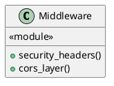
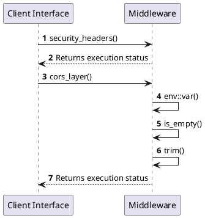

# Module Specification: Middleware

* **Source Reference:** `src/interface/http/middleware.rs`
* **Package Dependency:**
- `use axum::http::{HeaderName, HeaderValue};`
- `use std::env;`
- `use tower_http::cors::{AllowOrigin, CorsLayer};`
- `use tower_http::set_header::SetResponseHeaderLayer;`

## 1. Executive Summary & Purpose
Deterministic technical architecture for the `Middleware` module extracted directly from the codebase.

## 2. UML 2.0 Diagrams
### Class & Inheritance Architecture

### Execution Flow & Runtime Behavior

## 3. Data Structures, Structs & Class Properties

No notable data structures or fields in this module.

## 4. Comprehensive Methods & Functions Breakdown

### `security_headers`
* **Visibility:** +
* **Source Line Citation:** `src/interface/http/middleware.rs:L6`

#### Input Parameters
| Parameter | Data Type | Required / Default | Semantic Description |
| :--- | :--- | :--- | :--- |
| None | None | N/A | No parameters |

#### Return Value & Output Shape
| Return Type | Scenario | Description |
| :--- | :--- | :--- |
| `Vec<SetResponseHeaderLayer<HeaderValue>>` | Success | Result of the operation |

### `cors_layer`
* **Visibility:** +
* **Source Line Citation:** `src/interface/http/middleware.rs:L33`

#### Input Parameters
| Parameter | Data Type | Required / Default | Semantic Description |
| :--- | :--- | :--- | :--- |
| None | None | N/A | No parameters |

#### Return Value & Output Shape
| Return Type | Scenario | Description |
| :--- | :--- | :--- |
| `Option<CorsLayer>` | Success | Result of the operation |

## 5. Source Code Citations & Index
* Class `Middleware`: `src/interface/http/middleware.rs:L1`
* Method `security_headers`: `src/interface/http/middleware.rs:L6`
* Method `cors_layer`: `src/interface/http/middleware.rs:L33`
